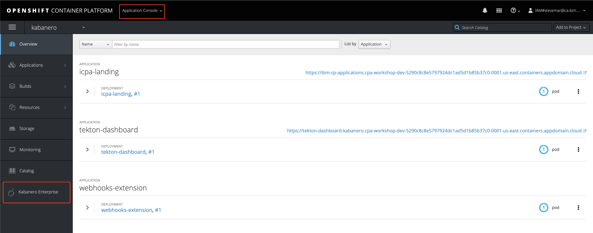
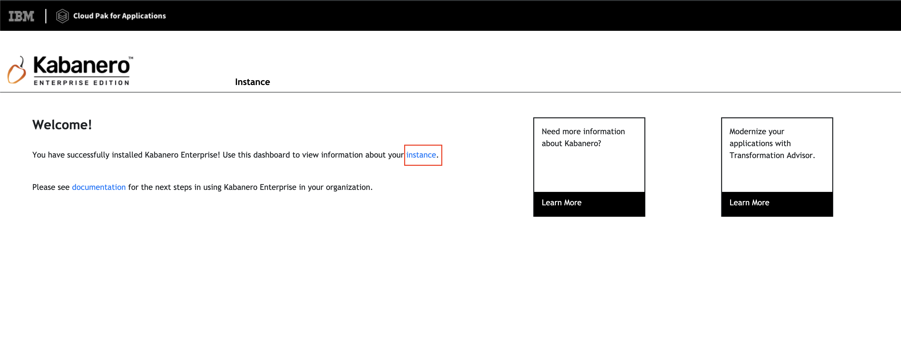
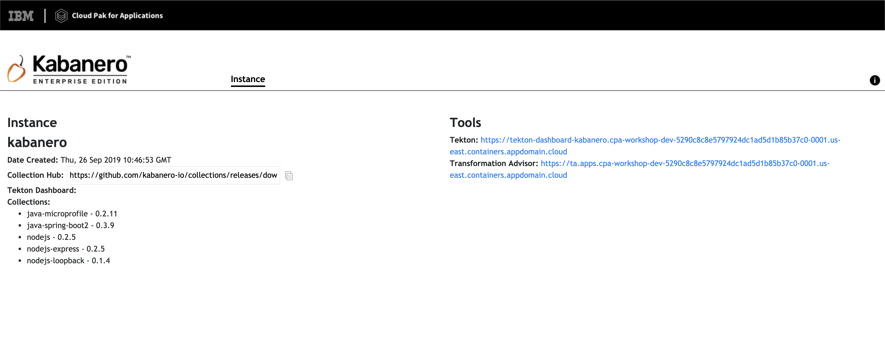

# Pre-work

This section is broken up into the following steps:

1. [Install Docker](#1-install-docker)
1. [Install the Appsody CLI](#2-install-the-appsody-cli)
1. [Check access to your Managed OpenShift Cluster](#3-check-access-to-your-managed-openshift-cluster)
1. [Check that Cloud Pak for Applications has been installed in the Cluster](#4-check-that-Cloud-Pak-for-Applications-has-been-installed-in-the-Cluster)

## 1. Install Docker

A key part of the Appsody development experience is Rapid Local Development Mode, where the code you develop is continuously being run in a local docker container. If you don't already have Docker installed on your machine, you should do so now:

[Install Docker](https://docs.docker.com/get-started/)

## 2. Install the Appsody CLI

Appsody includes a CLI which allows you to manage you stack based development. This should be installed on your development machine:

[Install the Appsody CLI](https://appsody.dev/docs/getting-started/installation)

## 3. Check access to your Managed OpenShift Cluster

You should already have been provided with details of a managed OpenShift cluster that has been provisioned for you. Check you have access to this by using the `oc login` with the credentials the workshop administrator provides to you.

```bash
oc login <url> --token=<token>
```

## 4. Check that Cloud Pak for Applications has been installed in the Cluster

Cloud Pak for Applications should already have been installed in your managed OpenShift cluster. Check you have access to this by ensuring that *Kabanero Enterprise* exists in the *Application Console* of your OpenShift cluster.



When clicked, the *Cloud Pak for Applications* landing page should appear:



Clicking on the *Kabanero Enterprise instance* link will show you information about your Kabanero Enterprise service.



## 5. IDs

Need IDs for the following:

* Github
* Docker Hub (trying to remove this)
* IBM Cloud (maybe?)
