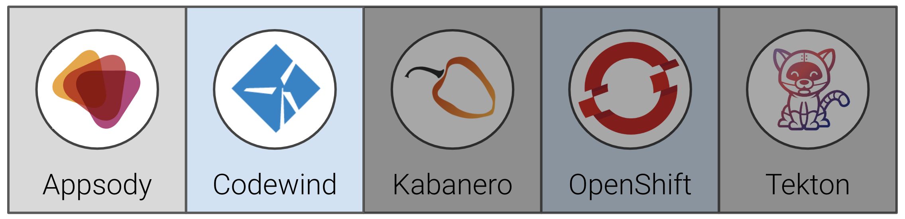

# Exercise 1: Introduction to Appsody

In this exercise, we will introduce Appsody, which is the underpinning development flow in Kabanero. In particular you will become experienced with:

* the components of the Appsody development toolbox
* the concept of pre-configured "stacks" and templates for popular open source runtimes (such as Node.js and Spring Boot) on which to build applications
* the Appsody command-line interface to develop containerized applications, how to run and test them locally,



## Prerequisites

You should have already carried out the prerequisites defined in the [Pre-work](../pre-work/README.md). Check that you have access to the Appsody CLI by typing (the exact version number my be greater than shown below):

> **NOTE:** In the exercises that follow you will see the actual command to run, followed by a separate example of running the command with the expected output. You only need to run the first example and never need to run a command you see preceded by a "$". You can even use the copy button on the right side of the command to make copying easier.

```bash
appsody version
```

You should see output similar to the following:

```bash
$ appsody version
appsody 0.5.3
```

## Steps

1. [Configure Appsody CLI](#1-configure-appsody-cli)
1. [Use Appsody CLI to build, test, run, and debug](#2-use-appsody-cli-to-build-test-run-and-debug)
1. [Appsody tasks on VS Code](#3-appsody-tasks-on-vs-code)

### 1. Configure Appsody CLI

In this section we'll configure our Appsody CLI to pull in Collections.

#### List existing Appsody stacks

The Appsody CLI gives you access to stacks, which are stored in stack repositories. These can be local, private to the Enterprise or public. To get the list of available repos, run this command.

```bash
appsody repo list
```

You should see output similar to the following:

```bash
$ appsody repo list
NAME            URL
*incubator      https://github.com/appsody/stacks/releases/latest/download/incubator-index.yaml
```

The exact repo list may be different to the above. `incubator` is one of the repos in the appsody project public hub (`appsodyhub`). For this workshop we are going to use the private enterprise-grade collection of stacks that come with the Kabanero open source project (which is part of Cloud Pak for Applications). So the first thing we need to do is to tell the CLI about this.

#### Add Collection to Appsody

From the Cloud Pak for Applications landing page get the `CollectionHub` URL, for example:

`https://github.com/kabanero-io/collections/releases/download/0.2.1/kabanero-index.yaml`

Use the appsody CLI to add the Collection repo.

```bash
appsody repo add kabanero https://github.com/kabanero-io/collections/releases/download/v0.1.2/kabanero-index.yaml
```

Now when we get our list of repos, we should see Kabanero listed:

```bash
appsody repo list
```

You should see output similar to the following:

```bash
$ appsody repo list
NAME            URL
*incubator      https://github.com/appsody/stacks/releases/latest/download/incubator-index.yaml
kabanero        https://github.com/kabanero-io/collections/releases/download/v0.1.2/kabanero-index.yaml
```

We can now list the appsody stacks available in the Collection:

```bash
appsody list kabanero
```

You should see output similar to the following:

```bash
$ appsody list kabanero
REPO        ID                  VERSION     TEMPLATES           DESCRIPTION
kabanero    java-microprofile   0.2.11      *default            Eclipse MicroProfile on Open Liberty & OpenJ9 using Maven
kabanero    java-spring-boot2   0.3.9       *default, kotlin    Spring Boot using OpenJ9 and Maven
kabanero    nodejs              0.2.5       *simple             Runtime for Node.js applications
kabanero    nodejs-express      0.2.5       *simple, skaffold   Express web framework for Node.js
kabanero    nodejs-loopback     0.1.4       *scaffold           LoopBack 4 API Framework for Node.js
```

Given that we'll exclusively be using the kabanero stacks in this workshop, for ease of use we can set the kabanero repository to be the default for the CLI:

```bash
appsody repo set-default kabanero
```

Now is we get the list of repos, we should see kabanero is the default:

```bash
appsody repo list
```

You should see output similar to the following:

```bash
$ appsody repo list
NAME            URL
*kabanero       https://github.com/kabanero-io/collections/releases/download/v0.1.2/kabanero-index.yaml
incubator       https://github.com/appsody/stacks/releases/latest/download/incubator-index.yaml
```

### 2. Use Appsody CLI to build, test, run, and debug

In this section we'll be using the following appsody commands:

* `appsody init`
* `appsody run`
* `appsody test`
* `appsody build`

#### Create a new directory to work with new applications

We recommend creating a new directory from your user home to work with new Appsody based applications, i.e.:

```bash
cd ~
mkdir appsody-apps
cd appsody-apps
```

#### Create a new application

We will now use one of the stacks to create an application. First, create a new directory for the project and change directory into it.

```bash
mkdir appsody_sample_nodejs-express
cd appsody_sample_nodejs-express/
```

Initialize the project using `appsody init`:

```bash
appsody init kabanero/nodejs-express
```

The directory has been initialized with a minimal set of artifacts (which is, in fact, a sample application that uses the chosen stack)

```bash
.
├── .appsody-config.yaml
├── .gitignore
├── .vscode
│  ├── launch.json
│  └── tasks.json
├── app.js
├── package-lock.json
├── package.json
└── test
    └── test.js
```

The key artifacts are:

* app.js
  Node.js application module (the default sample application is a simple "hello world")

* package.json
  NPM package JSON file

* test.js
  A simple test module

#### Run the application

The sample application comes ready to run using appsody:

```bash
appsody run
```

This step results in the stack image, with the sample application mounted into it, run in your local Docker environment. The output finishes by giving you the endpoint for the application.

```bash
Running development environment...
Running command: docker pull kabanero/nodejs-express:0.2
Running docker command: docker run --rm -p 3000:3000 -p 8080:8080 -p 9229:9229 --name appsody-sample-nodejs-express-dev -v /Users/csantanapr/dev/kabanero/appsody_sample_nodejs-express/:/project/user-app -v appsody-sample-nodejs-express-deps:/project/user-app/node_modules -v /Users/csantanapr/.appsody/appsody-controller:/appsody/appsody-controller -t --entrypoint /appsody/appsody-controller kabanero/nodejs-express:0.2 --mode=run
[Container] Running APPSODY_PREP command: npm install --prefix user-app
audited 295 packages in 1.546s
[Container] found 0 vulnerabilities
[Container]
[Container] Running command:  npm start
[Container]
[Container] > nodejs-express@0.2.6 start /project
[Container] > node server.js
[Container]
[Container] [Sun Sep 22 23:29:50 2019] com.ibm.diagnostics.healthcenter.loader INFO: Node Application Metrics 5.0.5.201909191743 (Agent Core 4.0.5)
[Container] [Sun Sep 22 23:29:51 2019] com.ibm.diagnostics.healthcenter.mqtt INFO: Connecting to broker localhost:1883
[Container] App started on PORT 3000
```

We can now check that this is running by hitting the endpoint <http://localhost:3000>:

```bash
curl http://localhost:3000
```

You should see output similar to the following:

```bash
$ curl http://localhost:3000
Hello from Appsody!
```

By default, the template sample application also provides the following endpoints.

* Readiness endpoint: <http://localhost:3000/ready>
* Liveness endpoint: <http://localhost:3000/live>
* Health check endpoint: <http://localhost:3000/health>
* Metrics endpoint: <http://localhost:3000/metrics>

For more details on this particular stack, refer to [Node.js Express
Stack](https://github.com/kabanero-io/collections/blob/master/incubator/nodejs-express/README.md).

#### Stop the application

To stop the application container, run this command from the same directory (e.g. in another terminal window):

```bash
appsody stop
```

#### Test the application

A stack will typically come with a test framework - and this can be initiated by running:

```bash
appsody test
```

You should see output similar to the following:

```bash
$ appsody test
Running test environment
Running command: docker pull kabanero/nodejs-express:0.2
Running docker command: docker run --rm -p 3000:3000 -p 8080:8080 -p 9229:9229 --name appsody-sample-nodejs-express-dev -v /Users/csantanapr/dev/kabanero/appsody_sample_nodejs-express/:/project/user-app -v appsody-sample-nodejs-express-deps:/project/user-app/node_modules -v /Users/csantanapr/.appsody/appsody-controller:/appsody/appsody-controller -t --entrypoint /appsody/appsody-controller kabanero/nodejs-express:0.2 --mode=test
[Container] Running APPSODY_PREP command: npm install --prefix user-app
added 170 packages from 578 contributors and audited 295 packages in 2.76s
...
[Container] Running command:  npm test && npm test --prefix user-app
[Container]
[Container] > nodejs-express@0.2.6 test /project
[Container] > mocha
...
[Container] App started on PORT 3000
...
[Container]
[Container]   7 passing (44ms)
[Container]
[Container]
[Container] > nodejs-express-simple@0.1.0 test /project/user-app
[Container] > mocha
[Container]
...
[Container] App started on PORT 3000
[Container]   Node.js Express Simple template
[Container]     / endpoint
[Container]       ✓ status
[Container]
[Container]
[Container]   1 passing (40ms)
[Container]
[Container] The file watcher is not running because no APPSODY_RUN/TEST/DEBUG_ON_CHANGE action was specified or it has been disabled using the --no-watcher flag.
```


#### Build the application

Up until now, we have been using appsody in what we call "Rapid Local Development Mode", where we can cycle through code change, test and debug - all within a local Docker environment. Appsody is making this environment possible, through a combination of the CLI, the stack and appsody code within that stack. Once you are ready to deploy the application outside of appsody control, there are two additional appsody commands to help you.

These enable a couple of capabilities:

* support for building a standalone docker image (containing your application and the stack technologies), that can be deployed either using regular Docker commands, or manually to a kubernetes cluster.
* support deploying the final image directly to a kubernetes cluster, under control of the Appsody Operator. We will cover deployment in [Exercise 3](../exercise-3/README.md).

In this section we will carry out the first of these - i.e. simply building a standalone image. Perhaps unsurprisingly, this is enacted by:

```bash
appsody build
```

You should see output similar to the following:

```bash
$ appsody build
.
.
.
[Docker] Removing intermediate container 264b4dd86f2c
[Docker]  ---> 3a7e5ca613f2
[Docker] Step 20/21 : EXPOSE 3000
[Docker]  ---> Running in fb7b734205a8
[Docker] Removing intermediate container fb7b734205a8
[Docker]  ---> badce710593d
[Docker] Step 21/21 : CMD ["npm", "start"]
[Docker]  ---> Running in 961a344e2c68
[Docker] Removing intermediate container 961a344e2c68
[Docker]  ---> e417d7dfc54c
[Docker] Successfully built e417d7dfc54c
[Docker] Successfully tagged appsody-sample-nodejs-express:latest
Built docker image appsody-sample-nodejs-express
```

We now have a standalone image (independent of appsody).  We can view the image using our local Docker environment:

```bash
docker images
```

You should see output similar to the following:

```bash
$ docker images
REPOSITORY                                  TAG                 IMAGE ID            CREATED             SIZE
appsody-sample-nodejs-express               latest              0be125eee32c        3 minutes ago       945MB
```

We can run this with our local Docker environment in the normal way (making sure we map the exposed port):

```bash
docker run -p 3000:3000 appsody-sample-nodejs-express
```

You should see output similar to the following:

```bash
$ docker run -p 3000:3000 appsody-sample-nodejs-express
...
> nodejs-express@0.2.6 start /project
> node server.js
...
[Tue Oct  1 19:49:45 2019] com.ibm.diagnostics.healthcenter.loader INFO: Node Application Metrics 5.0.5.201910011945 (Agent Core 4.0.5)
[Tue Oct  1 19:49:46 2019] com.ibm.diagnostics.healthcenter.mqtt INFO: Connecting to broker localhost:1883
App started on PORT 3000
```

Again, hitting the endpoint of <http://localhost:3000/> should give us the hello message.

You now have seen the basics of the appsody CLI in operation. You can now terminate the current docker run using Ctrl-C.

**Congratulations**! You've just completed the intro exercises for Appsody!
