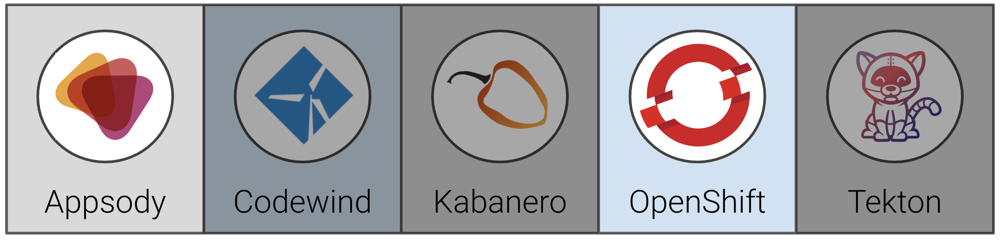
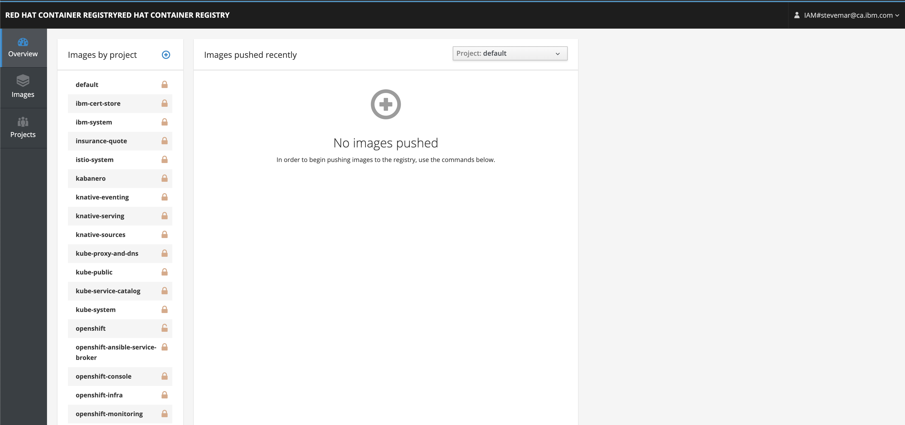
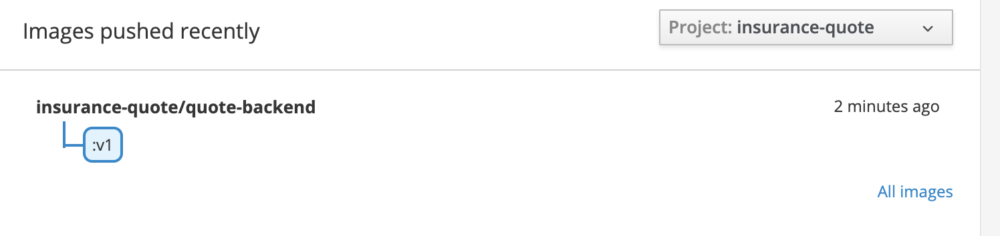
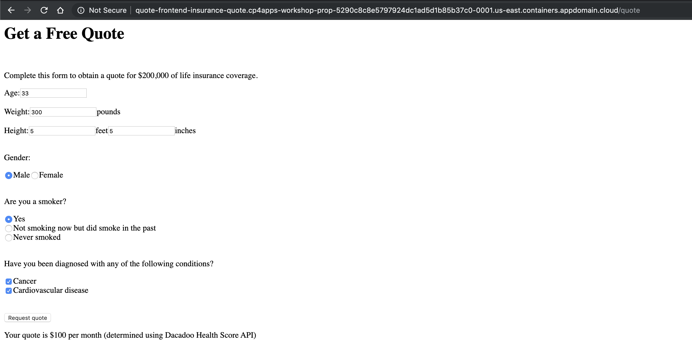

# Exercise 3: Deploying to OpenShift with Appsody

In this exercise, we will show how to deploy the sample insurance quote application built in [Exercise 2](workshop/exercise-2/README.md) to OpenShift using Appsody. Appsody is an open source project that provides the following tools you can use to build cloud-native applications:

When you have completed this exercise, you will understand how to:

* deploy the applications to OpenShift using the appsody CLI

In later exercises we will learn how to use appsody with a Tekton pipeline, hooked to git, to trigger an automated deployment.



## Prerequisites

You should have already carried out the prerequisites defined in [Exercise 0](workshop/exercise-0/README.md), and in addition:

* In order for the backend application to access the Dacadoo Health Score API, visit <https://models.dacadoo.com/doc/> to register and request an API key for evaluation purposes. Access to this API is usually granted individually to those that apply. You need to record the `url` for the API (displayed by clicking on the Health Score link under Models - usually `https://models.dacadoo.com/score/2`) and the `Key` (something similar to `UFDzMHAfsEg0oKzGp4rCSmXPClKKq3hDPLbPdvc2h`). There is a mock implementation of the API in the code that you can use if you do not want to register.

## Steps

1. [Set up a project namespace](#1-set-up-a-project-namespace)
1. [Access the internal Docker Registry](#2-access-the-internal-docker-registry)
1. [Deploy the backend application to OpenShift](#3-deploy-the-backend-application-to-openshift)
1. [Deploy the frontend application to OpenShift](#4-deploy-the-frontend-application-to-openshift)

### 1. Set up a project namespace

OpenShift applications are deployed within a project. So the first step is to create a new project:

``` bash
oc new-project insurance-quote
```

You should see output similar to the following:

``` bash
$ oc new-project insurance-quote
Now using project "insurance-quote" on server "https://c100-e.us-east.containers.cloud.ibm.com:31718".

You can add applications to this project with the 'new-app' command. For example, try:

    oc new-app centos/ruby-25-centos7~https://github.com/sclorg/ruby-ex.git

to build a new example application in Ruby.
```

Check that the current context is your team’s project space.

``` bash
oc project -q
```

### 2. Access the internal Docker Registry

We need a spot to push our newly built Docker images that Appsody created for us. Luckily, OpenShift comes with an internal Docker registry we can use. However, this registry is not enabled for public access by default.

Running the `oc get route --all-namespaces` command below shows us that only a dashboard for the registry is available. Not quite what we need.

```bash
oc get route --all-namespaces | grep registry
```

You should see output similar to the following:

```bash
$ oc get route --all-namespaces | grep registry
default    registry-console    registry-console-default.cp4apps-workshop-prop-5290c8c8e5797924dc1ad5d1b85b37c0-0001.us-east.containers.appdomain.cloud
```



To access the internal registry we need to create a route and expose it. See the [IBM Cloud documentation](https://cloud.ibm.com/docs/openshift?topic=openshift-openshift-images#openshift_internal_registry) for the complete steps, but here is the short version.

Run the following to create a new route.

```bash
oc create route reencrypt docker-registry --service=docker-registry -n default
```

Describing the route we can see it although it now exists, there is no path exposed by the proxy (which would be indicated by an `annotation`):

```bash
$ oc describe route docker-registry -n default
Name:    docker-registry
Namespace:    default
Created:    20 seconds ago
Labels:    docker-registry=default
Annotations:    openshift.io/host.generated=true
Requested Host:    docker-registry-default.cp4apps-workshop-prop-5290c8c8e5797924dc1ad5d1b85b37c0-0001.us-east.containers.appdomain.cloud
      exposed on router router 20 seconds ago
Path:    <none>
TLS Termination:    reencrypt
Insecure Policy:    <none>
Endpoint Port:    5000-tcp

Service:    docker-registry
Weight:    100 (100%)
Endpoints:    172.30.112.3:5000, 172.30.112.4:5000
```

Give the route a `path`:

```bash
oc patch route docker-registry -n default --type='json' -p='[{"op": "add", "path": "/metadata/annotations/haproxy.router.openshift.io~1balance", "value":"source"}]'
```

The proxy annotation should not be in place, i.e.:

```bash
$ oc describe route docker-registry -n default
Name:    docker-registry
Namespace:    default
Created:    20 seconds ago
Labels:    docker-registry=default
Annotations:    haproxy.router.openshift.io/balance=source
                openshift.io/host.generated=true
Requested Host:    docker-registry-default.cp4apps-workshop-prop-5290c8c8e5797924dc1ad5d1b85b37c0-0001.us-east.containers.appdomain.cloud
      exposed on router router 3 minutes ago
Path:    <none>
TLS Termination:    reencrypt
Insecure Policy:    <none>
Endpoint Port:    5000-tcp

Service:    docker-registry
Weight:    100 (100%)
Endpoints:    172.30.112.3:5000, 172.30.112.4:5000
```

We can now get the Docker registry URL:

```bash
oc get route --all-namespaces | grep registry
```

You should see output similar to the following:

```bash
$ oc get route --all-namespaces | grep registry
default    docker-registry    docker-registry-default.cp4apps-workshop-prop-5290c8c8e5797924dc1ad5d1b85b37c0-0001.us-east.containers.appdomain.cloud
default    registry-console    registry-console-default.cp4apps-workshop-prop-5290c8c8e5797924dc1ad5d1b85b37c0-0001.us-east.containers.appdomain.cloud
```

The URL we want to use is the `docker-registry` one, it'll look like `docker-registry-default.*.containers.appdomain.cloud`.

Once we have the URL, set it as a variable:

```bash
export DOCKER_REGISTRY=<docker_url>
```

And set our local `docker` command to use that registry, use `docker login`:

```bash
docker login -u $(oc whoami) -p $(oc whoami -t) $DOCKER_REGISTRY
```

### 3. Deploy the backend application to OpenShift

We will use the `appsody deploy` command for the deployments. This command:

* builds a deployment image for production usage (i.e. it does not include development-mode tools)
* pushes the image to your designated image registry
* builds a deployment yaml file (if you have not generated one already), as a CR for the Appsody Operator
* applies the yaml file to your Kubernetes cluster

Appsody has the ability to deploy directly to a kubernetes cluster using a default deployment manifest. This will work if the cluster does not require any specific credentials. In this case, we will need to provide these, so appsody allows you to generate the deployment manifest it would have used, but without doing the actual deployment. We can then modify this, and then ask appsody to use it for the deployment of our applications.

#### 3.1 Create a config map for the Dacadoo API key

In order to have the backend application send requests to the Dacadoo Health Score API, we need to create a secret that contains the configuration for making requests to the Dacadoo server, that you obtained in the pre-requisites of this exercise. (Note: If you do not want to use the Dacadoo Health Score API, you can skip this setup and continue to use the mock endpoint.)

```bash
oc create configmap dacadoo-config --from-literal=url=<url> --from-literal=apikey=<apikey>
```

where:

* `<url>` is the URL of the Dacadoo server (usually `https://models.dacadoo.com/score/2`)
* `<apikey>` is the API key that you obtained when you registered to use the API.

for example:

```bash
oc create configmap dacadoo-config --from-literal=DACADOO_URL=https://models.dacadoo.com/score/2 --from-literal=DACADOO_APIKEY=Y3VB...RMGG
configmap/dacadoo-config created
```

#### 3.2 Deploy the backend application

Navigate to your `quote-backend` directory. We need to modify the deployment yaml to pass the secret's values to the application. The initial deployment yaml can be generated as follows.

```bash
cd ~/appsody-apps/quote-backend
appsody deploy --generate-only
```

This creates a file named `app-deploy.yaml` in your project.

```yaml
apiVersion: appsody.dev/v1beta1
kind: AppsodyApplication
metadata:
  name: quote-backend
spec:
  # Add fields here
  version: 1.0.0
  applicationImage: dev.local/quote-backend
  stack: java-spring-boot2
  service:
    type: NodePort
    port: 8080
    annotations:
      prometheus.io/scrape: 'true'
      prometheus.io/path: '/actuator/prometheus'
  readinessProbe:
    failureThreshold: 12
    httpGet:
      path: /actuator/health
      port: 8080
    initialDelaySeconds: 5
    periodSeconds: 2
  livenessProbe:
    failureThreshold: 12
    httpGet:
      path: /actuator/liveness
      port: 8080
    initialDelaySeconds: 5
    periodSeconds: 2
  expose: true
  createKnativeService: false
```

We need to add a section to the generated file. Under the `spec` key, create a new `envFrom` key that has the value of your OpenShift config map. `dacadoo-config` was used as the name in this workshop.

> **TIP**: Ensure there are two spaces before `name`, see <https://github.com/kubernetes/kubernetes/issues/46826#issuecomment-305728020>

```yaml
apiVersion: appsody.dev/v1beta1
kind: AppsodyApplication
metadata:
  name: quote-backend
spec:
  # Add fields here
  version: 1.0.0
  .
  .
  envFrom:
    - configMapRef:
        name: dacadoo-config
  expose: true
  createKnativeService: false
```

Now use `appsody deploy` to push the image and deploy it. When using the OpenShift docker registry, the urls used to push and pull a given image are different. `appsody deploy` allows us to specify these on the command line:

```bash
appsody deploy --tag insurance-quote/quote-backend:v1 --push-url $DOCKER_REGISTRY --push --pull-url docker-registry.default.svc:5000 --namespace insurance-quote
```

```bash
$ appsody deploy --tag insurance-quote/quote-backend:v1 --push-url $DOCKER_REGISTRY --push --pull-url docker-registry.default.svc:5000 --namespace insurance-quote
.
.
[Docker] Successfully built 4294712e0f9e
[Docker] Successfully tagged docker-registry-default.cp4apps-workshop-prop-5290c8c8e5797924dc1ad5d1b85b37c0-0001.us-east.containers.appdomain.cloud/insurance-quote/quote-backend:v1
Built docker image docker-registry-default.cp4apps-workshop-prop-5290c8c8e5797924dc1ad5d1b85b37c0-0001.us-east.containers.appdomain.cloud/insurance-quote/quote-backend:v1
Using applicationImage of: docker-registry-default.cp4apps-workshop-prop-5290c8c8e5797924dc1ad5d1b85b37c0-0001.us-east.containers.appdomain.cloud/insurance-quote/quote-backend:v1
Pushing docker image docker-registry-default.cp4apps-workshop-prop-5290c8c8e5797924dc1ad5d1b85b37c0-0001.us-east.containers.appdomain.cloud/insurance-quote/quote-backend:v1
Attempting to apply resource in Kubernetes ...
Running command: kubectl apply -f app-deploy.yaml --namespace insurance-quote
Deployment succeeded.
Appsody Deployment name is: quote-backend
Running command: kubectl get rt quote-backend -o jsonpath="{.status.url}" --namespace insurance-quote
Attempting to get resource from Kubernetes ...
Running command: kubectl get route quote-backend -o jsonpath={.status.ingress[0].host} --namespace insurance-quote
Deployed project running at quote-backend-insurance-quote.cp4apps-workshop-prop-5290c8c8e5797924dc1ad5d1b85b37c0-0001.us-east.containers.appdomain.cloud
```

> **NOTE**: If the deployment times out, see the section [Pushing to the OpenShift registry times out](../admin-guide/README.md#pushing-to-the-openshift-registry-times-out) in the Admin Guide.
> **NOTE**: Running `appsody deploy` will install the [appsody operator](https://github.com/appsody/appsody-operator) on the *Default* namespace of the cluster.

After the deployment completes, you can test the service using curl. The deployment should complete with something like:

```bash
curl -X POST -d @backend-input.json  -H "Content-Type: application/json"  http://<url-to-backend>/quote
```

You should see output similar to the following:

```bash
$ curl -X POST -d @backend-input.json -H "Content-Type: application/json" http://<url-to-backend>/quote
{"quotedAmount":70,"basis":"Dacadoo Health Score API"}
```

where:

* `<url-to-backend>` is the endpoint given above at the end of running appsody deploy (i.e. *quote-backend-insurance-quote.cp4apps-workshop-prop-5290c8c8e5797924dc1ad5d1b85b37c0-0001.us-east.containers.appdomain.cloud* in the example above)

> **NOTE**: If you are not using the Dacadoo Health Score API, you may see different text for the value of "basis" -- ("mocked backend computation" instead of "Dacadoo Health Score API").

Navigating back to the registry dashboard should show the new image.



### 4. Deploy the frontend application to OpenShift

We are now going to deploy the frontend application to OpenShift. The steps are similar to what we did for the backend application.

First we need to generate the deployment yaml so that we can edit it. Change the current directory back to the frontend application and generate the deployment yaml.

```bash
cd ../quote-frontend
appsody deploy --generate-only
```

Edit the file that was created, `app-deploy.yaml`, and add the `env` section as shown below (which defines an environment variable with the URL of the backend application within the cluster, be sure to include `/quote` at the end). Be careful to match the indentation (`env:` is indented the same number of spaces as `applicationImage:`). `url-to-backend` is the same as the one we tested about against the backend.

```yaml
apiVersion: appsody.dev/v1beta1
kind: AppsodyApplication
metadata:
  name: quote-frontend
spec:
  # Add fields here
  version: 1.0.0
  applicationImage: quote-frontend
  env:
  - name: BACKEND_URL
    value: <url-to-backend>
  .
  .
  .
```

Save the yaml file and do the deployment.

```bash
appsody deploy --tag insurance-quote/quote-frontend:v1 ---push-url $DOCKER_REGISTRY --push --pull-url docker-registry.default.svc:5000 --namespace insurance-quote
```

```bash
$ appsody deploy --tag insurance-quote/quote-frontend:v1 ---push-url $DOCKER_REGISTRY --push --pull-url docker-registry.default.svc:5000 --namespace insurance-quote
...
[Docker] Successfully built ba7451568a04
[Docker] Successfully tagged docker-registry-default.cp4apps-workshop-prop-5290c8c8e5797924dc1ad5d1b85b37c0-0001.us-east.containers.appdomain.cloud/insurance-quote/quote-frontend:v1
Built docker image docker-registry-default.cp4apps-workshop-prop-5290c8c8e5797924dc1ad5d1b85b37c0-0001.us-east.containers.appdomain.cloud/insurance-quote/quote-frontend:v1
Using applicationImage of: docker-registry-default.cp4apps-workshop-prop-5290c8c8e5797924dc1ad5d1b85b37c0-0001.us-east.containers.appdomain.cloud/insurance-quote/quote-frontend:v1
Pushing docker image docker-registry-default.cp4apps-workshop-prop-5290c8c8e5797924dc1ad5d1b85b37c0-0001.us-east.containers.appdomain.cloud/insurance-quote/quote-frontend:v1
Attempting to apply resource in Kubernetes ...
Running command: kubectl apply -f app-deploy.yaml --namespace insurance-quote
Deployment succeeded.
Appsody Deployment name is: quote-frontend
Running command: kubectl get rt quote-frontend -o jsonpath="{.status.url}" --namespace insurance-quote
Attempting to get resource from Kubernetes ...
Running command: kubectl get route quote-frontend -o jsonpath={.status.ingress[0].host} --namespace insurance-quote
Deployed project running at quote-frontend-insurance-quote.cp4apps-workshop-prop-5290c8c8e5797924dc1ad5d1b85b37c0-0001.us-east.containers.appdomain.cloud
```

You can then use a browser to open the frontend application, at the url given above (in the example above the URL is `quote-frontend-insurance-quote.cp4apps-workshop-prop-5290c8c8e5797924dc1ad5d1b85b37c0-0001.us-east.containers.appdomain.cloud`). Fill in the form and click the button to submit it. You should get a quote from the backend application.



> **NOTE**: If you are not using the Dacadoo Health Score API, you may see different text after the quote
("determined using mocked backend computation" instead of "determined using Dacadoo Health Score API").

Congratulations, you have now deployed both front and backend applications to OpenShift, hooked them together as well as enable outreach to an external service.
