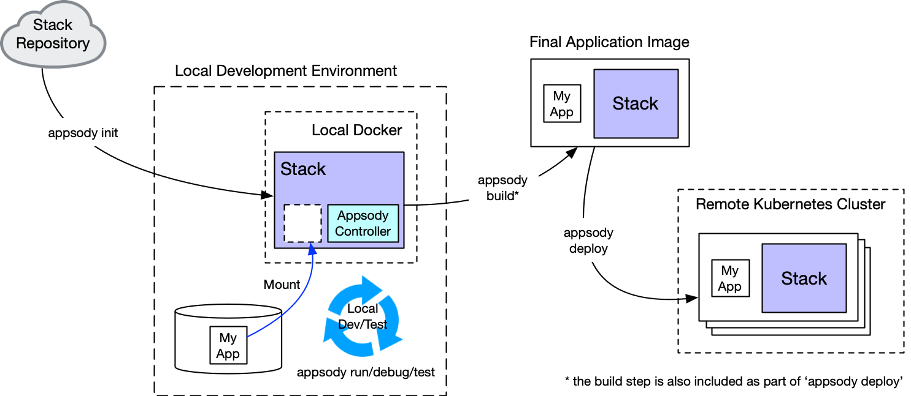

# Exercise 5: Customizing an existing Appsody Stack

> **NOTE**: To make your own stack, instead of extending one, follow this tutorial: <https://developer.ibm.com/tutorials/create-appsody-stack/>.

This section is broken up into the following steps:

1. [The role of a stack in the development process](#1-The-role-of-a-stack-in-the-development-process)
1. [Stack structure](#2-Stack-structure)
1. [Create a new stack, based on an existing one](#3-Create-a-new-stack,-based-on-an-existing-one)

## 1. The role of a stack in the development process

Developers use stacks to simplify building applications that require a specific set of technologies or development patterns. While there are numerous publicly available stacks to choose from, many enterprises want to build their own set of stacks that uphold their specific requirements and standards for how they want to their developers to build cloud native applications.

In this exercise, you will learn how to modify an existing stack to more closely match your requirements. Before starting this, let's do a quick review of the design requirements for stacks. A stack is designed to support the developer in either a rapid, local development mode or a build-and-deploy mode.

### Rapid, local development mode

In this mode, the stack contains everything a developer needs to build a new application on a local machine, with the application always running in a local containerized Docker environment. Introducing containerization from the start of the application development process (as opposed to development solely in the user space of the local machine) decreases the introduction of subtle errors in the containerization process and removes the need for a developer to install the core technology components of their application.

In this mode, the stack is required to have all the dependencies for the specific technologies pre-built into the Docker image, and also to dynamically compliment these with whatever dependencies the developer adds explicitly for his or her code.

Rapid local development mode in Appsody consists of the Appsody CLI (hooked into a local IDE if required) communicating with a local Docker container that is running the application under development. With this mode, application code can be held on the local file system, while being mounted in the Docker container, so that a local change can automatically trigger a restart of the application.

### Build-and-deploy mode

In this mode, the stack enables the Appsody CLI to build a self-contained Docker image that includes both the core technologies in the stack plus the application code, along with the combined dependencies of both. You can deploy the resulting image manually or programmatically to any platform that supports Docker images (such as a local or public Kubernetes cluster).

A pictorial view of how an application developer uses a stack, looks like this:



The above development flow shows the manual deployment to a Kubernetes cluster. In more production-orientated environments, GitOps might trigger the build and deploy steps and Tekton Pipelines would drive the deployment. [Kabanero Collections](https://github.com/kabanero-io/collections/), which is part of [Cloud Pak for Applications](https://www.ibm.com/cloud/cloud-pak-for-applications), brings together Appsody stacks, GitOps, and Tekton Pipelines to provide an enterprise-ready solution for cloud-native application development and deployment. We'll look at this in later exercises.

## 2. Stack structure

Because a single Appsody stack can enable both rapid, local development and build-and-deploy modes, all stacks follow a standard structure. The structure below represents the source structure of a stack:

```bash
my-stack
├── README.md
├── stack.yaml
├── image/
|   ├── config/
|   |   └── app-deploy.yaml
|   ├── project/
|   |   ├── [files that provide the technology components of the stack]
|   |   └── Dockerfile
│   ├── Dockerfile-stack
|   └── LICENSE
└── templates/
    ├── my-template-1/
    |       └── [example files as a starter for the application, e.g. "hello world"]
    └── my-template-2/
            └── [example files as a starter for a more complex application]

```

As a *Stack Architect* you must create the above structure, build it into an actual stack image ready for use by an *Application Developer* who bases their new application on your stack. Part of your role as a stack architect is to include one of more sample applications (known as *templates*) to help the application developer get started.

Hence, when you build a stack, the structure above is processed and generates a Docker image for the stack, along with tar files of each of the templates, which can then all be stored and referenced in a local or public Appsody repo. The Appsody CLI can access the repo to use the stack to initiate local development.

For this exercise we will modify the nodejs-express stack that we have been using for our quote-frontend, to add some additional security hardening (individual enterprises often has specific security standards that need to be met to allow deployment).

## 3. Create a new stack, based on an existing one

To create a new stack, you must first construct a scaffold of the above structure. Stacks are classified as being `stable`, `incubating` or `experimental`. You can read more about these classifications [here](https://appsody.dev/docs/stacks/stacks-overview). To make things easy, the Appsody CLI supports an `appsody stack create` command to create a new stack, by copying of an existing one.

> **Note** In general, Appsody will always try and look in the existing repositories first for stacks, and then in the local cache. For normal stack usage this is exactly what you want - however, when in the process of creating new stacks, by definition, the existing repositories will not yet know about your new stack. Hence it is quicker in this situation to tell Appsody to look in the local cache first. You can do this by setting the following environment variable: `export APPSODY_PULL_POLICY=IFNOTPRESENT`.

1. Copy and rename the nodejs-express stack, by running the `appsody stack create` command, which will create a sub directory containing the new stack.

    ```bash
    $ cd ~
    $ appsody stack create my-nodejs-express --copy incubator/nodejs-express
    $ cd my-nodejs-express
    $ ls - al
    total 16
    drwxr-xr-x  6 henrynash  staff  192 21 Oct 00:14 .
    drwxr-xr-x  3 henrynash  staff   96 21 Oct 00:14 ..
    -rw-r--r--  1 henrynash  staff  621 21 Oct 00:14 README.md
    drwxr-xr-x  7 henrynash  staff  224 21 Oct 00:14 image
    -rw-r--r--  1 henrynash  staff  297 21 Oct 00:14 stack.yaml
    drwxr-xr-x  3 henrynash  staff   96 21 Oct 00:14 templates
    ```

    If you inspect the contents of the `image` directory, you will see how it matches the stack structure given earlier.

1. Build your new stack

    BEfore we make any changes, let's go through the steps of building (or *packaging*) a stack, to create a stack image (which is a Docker image) that the Appsody CLI can use to initiate a project using that stack.

    There is a Docker file (`Dockerfile-stack`) within the sample stack structure you copied. The `appsody stack package` command will use this to build the image.

    To build your new stack in this way, from the `my-nodejs-express` directory enter:

    ```bash
    $ appsody stack package
    ```

    This runs a Docker build, installs `my-nodejs-express` into a local Appsody repository (called `dev-local`), and runs some basic tests to make sure the file is well formed.

    Once the build is complete, check that it is now available in the local repo:

    ```bash
    $ appsody list dev-local
    REPO        ID                 VERSION     TEMPLATES           DESCRIPTION
    dev-local   my-nodejs-express  0.2.7       scaffold, *simple   Express web framework for Node.js
    ```

1. Get the new stack working

    So, at this point, you have been carrying out your role as a stack architect to build and install your new (albeit unchanged) stack. Now it's time to try it out as an application developer.

    Create a new directory and initialize it with this new Appsody stack:

    ```bash
    $ mkdir ~/test
    $ cd ~/test
    $ appsody init dev-local/my-nodejs-express
    ```

    Now use `appsody run` to test running an application based on your copy of the stack:

    ```bash
    $ appsody run
    Running development environment...
    Using local cache for image dev.local/my-nodejs-express:SNAPSHOT
    Running docker command: docker run --rm -p 3000:3000 -p 9229:9229 --name test73-dev -v /Users/henrynash/codewind-workspace/test73/:/project/user-app -v test73-deps:/project/user-app/node_modules -v /Users/henrynash/.appsody/appsody-controller:/appsody/appsody-controller -t --entrypoint /appsody/appsody-controller dev.local/my-nodejs-express:SNAPSHOT --mode=run
    [Container] Running APPSODY_PREP command: npm install --prefix user-app && npm audit fix --prefix user-app
    added 170 packages from 578 contributors and audited 295 packages in 3.5s
    [Container] found 0 vulnerabilities
    .
    .
    .
    [Container] App started on PORT 3000
    ```

    To check it is running, we can use curl to hit the endpoint:

    ```bash
    curl -http://localhost:3000
    Hello from Appsody!
    ```

    So now we are ready to make change to our new stack. For this exercise we will harden the HTTP headers that an application, built using this stack, responds with. We can look at the current headers returned, by using the curl verbose option:

    ```bash
    curl -v http://localhost:3000
    * Rebuilt URL to: http://localhost:3000/
    *   Trying ::1...
    * TCP_NODELAY set
    * Connected to localhost (::1) port 3000 (#0)
    > GET / HTTP/1.1
    > Host: localhost:3000
    > User-Agent: curl/7.54.0
    > Accept: */*
    > 
    < HTTP/1.1 200 OK
    < X-Powered-By: Express
    < Content-Type: text/html; charset=utf-8
    < Content-Length: 19
    < ETag: W/"13-0ErcqB22cNteJ3vXrBgUhlCj8os"
    < Date: Mon, 21 Oct 2019 12:09:49 GMT
    < Connection: keep-alive
    < 
    * Connection #0 to host localhost left intact
    Hello from Appsody!
    ```

    For this exercise will modify the stack to include the popular HTTP header security module [helmet](https://helmetjs.github.io), and hence this should change the headers we see returned to us. Note we will do this as a *stack architect* since we don't want to rely on *application developers* remembering to do this. By doing this in the stack itself, all applications built using our modified stack will have helmet automatically enabled.

1. Modify your custom stack

    When creating a custom stack, based on an existing stack, the first thing to do is to take a look at what the existing stack has provided. A more detailed description of the stack components can be found [here](https://appsody.dev/docs/stacks/stack-structure), but the key ones are:

    * A Dockerfile (`image/Dockerfile-stack`) that builds your stack image. This is what the `appsody stack package` command used above to build a Docker image of your stack - which is, if you like, the eventual artifact that you deliver as a stack architect to application developers.
    * A Dockerfile (`image/project/Dockerfile`) that application developers will use to build their final image. This final image will contain both your stack and their application, and this Dockerfile is processed by the application developer running `appsody build/deploy`.
    * Typically some kind of server side code that is enabling the application then developer will create and run. For this stack, this is `image/project/server.js`.
    * Some kind of dependency management, ensuring both the correct inclusion of components defined by the stack,  as well as, potentially, any added by the application developer. For this stack, this is `image/project/package.json`.
    * At least one sample application (or *template*), these are stored in the `templates` directory.

    It is worth taking some time checking out the files given above to get a feel of the stack.

    Having done so, you might have already spotted what we need to do to incorporate helmet into the new stack - namely to modify `server.js` to enable it. The current code in `server.js` looks something like this:

    ```java
    // Requires statements and code for non-production mode usage
    if (!process.env.NODE_ENV || !process.env.NODE_ENV === 'production') {
    require('appmetrics-dash').attach();
    }
    const express = require('express');
    const health = require('@cloudnative/health-connect');
    const fs = require('fs');

    require('appmetrics-prometheus').attach();

    const app = express();

    const basePath = __dirname + '/user-app/';

    function getEntryPoint() {
        let rawPackage = fs.readFileSync(basePath + 'package.json');
        let package = JSON.parse(rawPackage);
        if (!package.main) {
            console.error("Please define a primary entrypoint of your application by agdding 'main: <entrypoint>' to package.json.")
            process.exit(1)
        }
        return package.main;
    }

    // Register the users app. As this is before the health/live/ready routes,
    // those can be overridden by the user
    const userApp = require(basePath + getEntryPoint()).app;
    app.use('/', userApp);

    const healthcheck = new health.HealthChecker();
    app.use('/live', health.LivenessEndpoint(healthcheck));
    app.use('/ready', health.ReadinessEndpoint(healthcheck));
    app.use('/health', health.HealthEndpoint(healthcheck));

    app.get('*', (req, res) => {
    res.status(404).send("Not Found");
    });

    const PORT = process.env.PORT || 3000;
    const server = app.listen(PORT, () => {
    console.log(`App started on PORT ${PORT}`);
    });

    // Export server for testing purposes
    module.exports.server = server;
    module.exports.PORT = PORT;
    ```

    We will modify this file by adding two lines, to `require` the inclusion of helmet (just after express), as well as enable it with `app.use`:

    ```java
    // Requires statements and code for non-production mode usage
    if (!process.env.NODE_ENV || !process.env.NODE_ENV === 'production') {
    require('appmetrics-dash').attach();
    }
    const express = require('express');
    const helmet = require('helmet');
    const health = require('@cloudnative/health-connect');
    const fs = require('fs');

    require('appmetrics-prometheus').attach();

    const app = express();
    app.use(helmet())

    const basePath = __dirname + '/user-app/';
    .
    .
    .
    ```

    Since we have added a new module that is required, we must also update the dependency management (package.json), to ensure this is pulled in:

    ```json
    {
    .
    .
    .
    "dependencies": {
        "@cloudnative/health-connect": "^2.0.0",
        "appmetrics-prometheus": "^3.0.0",
        "express": "~4.16.0",
        "helmet": "^3.21.1"
    },
    .
    .
    .
    }
    ```

    Now that we have modified our stack, we need to re-package it, using the same command as before:

    ```bash
    $ appsody stack package
    ```

    This will have updated the dev-local index, so we can again go and run our application:

    ```bash
    $ appsody run
    Running development environment...
    .
    .
    .
    [Container] App started on PORT 3000
    ```

    If we now hit the endpoint as before with curl in verbose mode, we can see if the HTTP headers have changed:

    ```bash
    CHANGE THIS
    curl -v http://localhost:3000
    * Rebuilt URL to: http://localhost:3000/
    *   Trying ::1...
    * TCP_NODELAY set
    * Connected to localhost (::1) port 3000 (#0)
    > GET / HTTP/1.1
    > Host: localhost:3000
    > User-Agent: curl/7.54.0
    > Accept: */*
    > 
    < HTTP/1.1 200 OK
    < X-Powered-By: Express
    < Content-Type: text/html; charset=utf-8
    < Content-Length: 19
    < ETag: W/"13-0ErcqB22cNteJ3vXrBgUhlCj8os"
    < Date: Mon, 21 Oct 2019 12:09:49 GMT
    < Connection: keep-alive
    < 
    * Connection #0 to host localhost left intact
    Hello from Appsody!
    ```

    As you should see, because the stack now incorporates helmet, our application also runs with this protection.

    A final step is to switch the actual quote-frontend application we built in [Exercise 2](/workshop/exercise-2/README.md) to use our new stack (rather than the original `nodejs-express` stack).

    The formal way of doing this is to repeat the steps from Exercise 2, where the new project in initialized, and the dependencies and code for the frontend are copied into the new project directory. However, in this case, where we have not changed anything that is actually placed directly in the project directory, we can take a short cut and just update the project to point at our new stack. This also gives you a bit more of an idea as to how an application project is linked to a stack. In the `quote-frontend` directory you created in Exercise 2, you should see a file called `.appsody-config.yaml`, which was created by the `appsody init` step.

    ```bash
    $ ls -al
    total 192
    drwxr-xr-x  16 henrynash  staff    512 15 Oct 12:42 .
    drwxr-xr-x+ 85 henrynash  staff   2720 17 Oct 21:37 ..
    -rw-r--r--   1 henrynash  staff     64 19 Oct 11:10 .appsody-config.yaml
    -rw-r--r--   1 henrynash  staff   1316 15 Oct 11:12 .gitignore
    drwxr-xr-x   4 henrynash  staff    128 15 Oct 11:12 .vscode
    -rw-rw-r--   1 henrynash  staff    806 15 Oct 12:50 app-deploy.yaml
    -rw-r--r--   1 henrynash  staff    290 15 Oct 11:15 app.js
    drwxr-xr-x   4 henrynash  staff    128 15 Oct 11:15 config
    drwxr-xr-x   2 henrynash  staff     64 15 Oct 11:16 node_modules
    -rw-r--r--   1 henrynash  staff      0 15 Oct 11:19 nodejs_dc.log
    -rw-r--r--   1 henrynash  staff      0 15 Oct 11:19 nodejs_restclient.log
    -rw-r--r--@  1 henrynash  staff  73319 15 Oct 11:16 package-lock.json
    -rw-r--r--   1 henrynash  staff    615 15 Oct 11:15 package.json
    -rw-r--r--   1 henrynash  staff   2779 15 Oct 11:15 quote.js
    drwxr-xr-x   3 henrynash  staff     96 15 Oct 11:12 test
    drwxr-xr-x   3 henrynash  staff     96 15 Oct 11:15 views
    ```

    Inspecting that file, reveals that it contains a pointer to the stack:

    ```bash
    $ cat .appsody-config.yaml
    project-name: quote-frontend
    stack: kabanero/nodejs-express:0.2
    ```

    We can simply change the second line to, instead, point out our new stack, i.e.:

    ```bash
    $ cat .appsody-config.yaml
    project-name: quote-frontend
    stack: dev-local/my-nodejs-express:0.2
    ```

    If now re-run the front end, it will use our new stack:

    WIP - to be continued....
