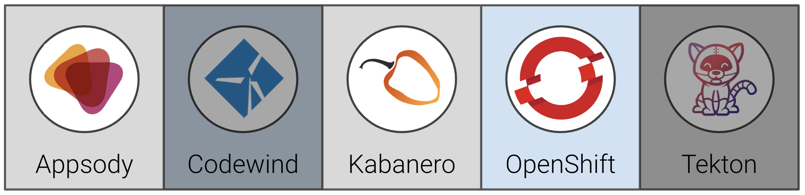
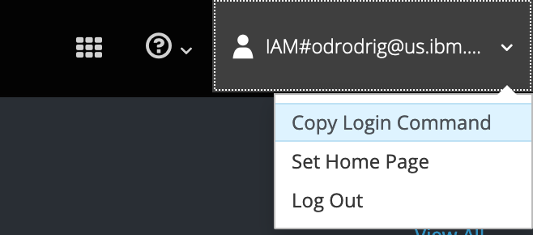
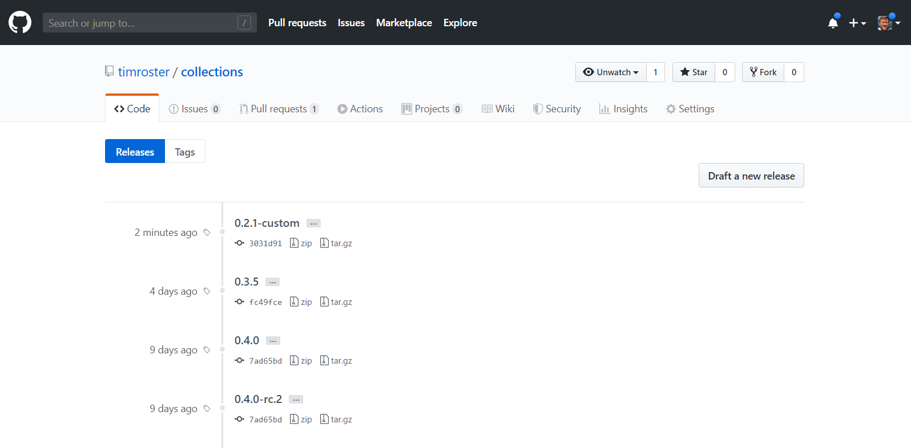
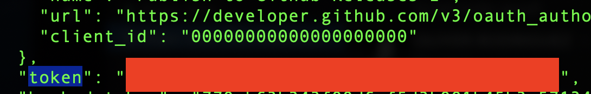
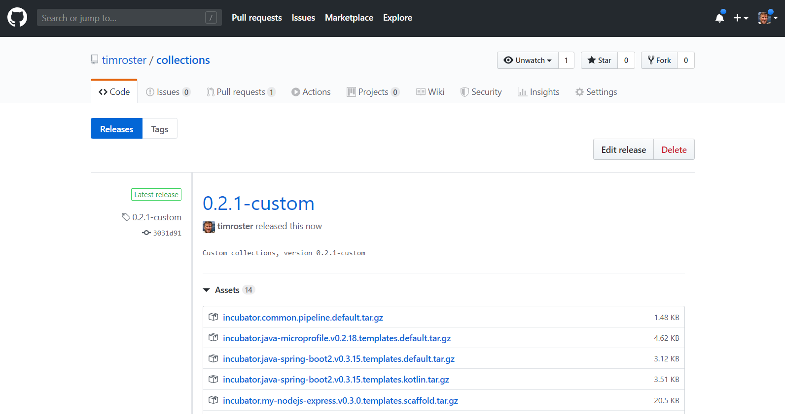

# Exercise 6: Building a custom Appsody Stack Collection in Kabanero

In this exercise, we will show how to create a custom Collection, that includes the custom Appsody Stack from the previous exercise.

When you have completed this exercise, you will understand how to

* clone and host your own Collection
* modify the Collection to include a custom Appsody Stack



## Prerequisites

You should have already carried out the prerequisites defined in [Exercise 5](../exercise-5/README.md). 

### Reauthenticate with you OpenShift cluster
Now that it's the start of a new day, we should reauthenticate with you cluster. Open up the link to your OpenShift cluster that the instructor has provided for you. 

Then once on the OpenShift dashboard, click on the dropdown at the top right and select `Copy Login Command`. This will automatically add the login command to your clipboard.



Next, all you have to do is paste it into your terminal and press enter.

## About custom Kabanero Repositories

By default the Kabanero open source project is configured to automatically use the latest release at [https://github.com/kabanero-io/collections](https://github.com/kabanero-io/collections).

The default collections can be modified to meet an organization's unique needs.

* Collections are categorized as either `stable`, `incubator` or `experimental` depending on the content of the collection.

  * `stable`: collections that meet a set of technical requirements.
  * `incubator`: collections that are actively being worked on to satisfy the stable criteria.
  * `experimental`: collections that are used for trying out specific capabilities or proof of concept work.

* Collections include an Appsody stack, and a Tekton pipeline.

## Steps

1. [Create a new repo to host your custom collection](#1-create-a-new-repo-to-host-your-custom-collection)
1. [Create a new image namespace to host images on OpenShift](#2-create-a-new-image-namespace-to-host-images-on-openshift)
1. [Set up a local build environment](#3-set-up-a-local-build-environment)
1. [Add our custom stack to the new collection](#4-add-our-custom-stack-to-the-new-collection)
1. [Build the new collection](#5-build-the-new-collection)
1. [Push collection images](#6-push-collection-images)
1. [Update code repo and release a new collection](#7-update-code-repo-and-release-a-new-collection)

### 1. Create a new repo to host your custom collection

Go to <https://github.com/new> and create a new repository, `collections`. Do not initiatize the repos with a license file or README.


Clone the default collections repository and create a new copy of it in your GitHub organization, replacing `<username>` with your own.

```bash
cd ~/appsody-apps/
git clone https://github.com/kabanero-io/collections
cd collections
git checkout tags/0.2.1 -b 0.2.1-custom
git remote add my-org https://github.com/<username>/collections.git
git push -u my-org
```

#### About the Kabanero Repo structure

```ini
ci
├── [ files used for CI/CD of the Collections ]
experimental (or incubator, or stable)
├── common/
|   ├── pipelines/
|   |   ├── common-pipeline-1/
|   |   |       └── [pipeline files that make up a full tekton pipeline used with all collections in experimental category]
|   |   └── common-pipeline-n/
|   |           └── [pipeline files that make up a full tekton pipeline used with all collections in experimental category]
├── collection-1/
|   ├── [collection files - see collection structure below]
└── collection-n/
    └── [collection files - see collection structure below]
```

### 2. Create a new image namespace to host images on OpenShift

To actually use the stacks we need images, images will be hosted on openshift

```bash
oc new-project kabanero-noauth
oc policy add-role-to-group registry-viewer system:unauthenticated -n kabanero-noauth
```

> NOTE: You may seem a warning about this step, but it should still have worked, e.g.

```bash
oc new-project kabanero-noauth
oc policy add-role-to-group registry-viewer system:unauthenticated -n kabanero-noauth
Warning: Group 'system:unauthenticated' not found
role "registry-viewer" added: "system:unauthenticated"
```

### 3. Set up a local build environment

There are several environment variables that need to be set up. These are required in order to correctly build the collections.

> NOTE: When setting the `TRAVIS_REPO_SLUG` variable, make sure you substitute the actual github repo you created above in place of `<username>`.

```bash
export IMAGE_REGISTRY_ORG=kabanero-noauth
export IMAGE_REGISTRY_PUBLISH=true
export IMAGE_REGISTRY_USERNAME=$(oc whoami)
export IMAGE_REGISTRY_PASSWORD=$(oc whoami -t)
export TRAVIS_REPO_SLUG=<username>/collections
export TRAVIS_TAG=0.2.1-custom
export IMAGE_REGISTRY=$(oc get route docker-registry -n default -o jsonpath="{.spec.host}")

```

```bash
echo $IMAGE_REGISTRY
```

```bash
$ echo $IMAGE_REGISTRY
IMAGE_REGISTRY=docker-registry-default.henrycluster6-5290c8c8e5797924dc1ad5d1b85b37c0-0001.eu-gb.containers.appdomain.cloud
```

### 4. Add our custom stack to the new collection

Now we take our custom stack from exercise 5 (recall that is was named `my-nodejs-express` and includes the `helmet` library) and copy it over to the incubator folder of our collection repo. From the `collections` repo, perform the following steps:

List the collections before the copy:

```bash
ls incubator
common java-spring-boot2 nodejs-express
java-microprofile nodejs nodejs-loopback
```

Now copy in our new custom stack:

```bash
cp -R ~/appsody-apps/my-nodejs-express incubator
```

Check that we now have this in the list of collections:

```bash
ls incubator
common java-spring-boot2 nodejs nodejs-loopback
java-microprofile my-nodejs-express nodejs-express triggers
```

Create a new file called `collection.yaml` in `collections/incubator/my-nodejs-express`, add the following:

```yaml
default-image: my-nodejs-express
default-pipeline: default
images:
- id: my-nodejs-express
  image: $IMAGE_REGISTRY_ORG/my-nodejs-express:0.4
```

Edit the new file called `stack.yaml` in `collections/incubator/my-nodejs-express`. Update the name and description fields to add "with Helmet" and also replace the maintainer information with your information if desired (you will probably see a different version, **don't** change that and keep as-is):

```yaml
name: Node.js Express with Helmet
version: 0.3.0
description: Express web framework for Node.js with Helmet
license: Apache-2.0
language: nodejs
maintainers:
  - name: Your Name
    email: your email
    github-id: yourgithubid
default-template: simple
```

And also create a directory called `pipelines` in `collections/incubator/my-nodejs-express`, and add a single empty file called `.gitkeep`.

### 5. Build the new collection

This step builds the `kabanero-index.yaml` file.

From the collections directory, run the build script. For example:

```bash
cd ~/appsody-apps/collections
IMAGE_REGISTRY_ORG=$IMAGE_REGISTRY/$IMAGE_REGISTRY_ORG ./ci/build.sh
```

> **NOTE**: This process can take several minutes to complete.

Note that this will build all the collections in the incubator directory, including the new `my-nodejs-express` stack.

Following the build, you can find the generated collection assets in the `collections/ci/assets/` directory and all the docker images in your local docker registry.

You should see output like the following, take note of the `my-nodejs-express` stack being built, and ensure there are no errors in the output:

```bash
...
Listing all stacks
Building stacks: incubator/java-microprofile incubator/java-spring-boot2 incubator/my-nodejs-express incubator/nodejs-express incubator/nodejs-loopback incubator/nodejs
...
- BUILDING stack: incubator/my-nodejs-express
File containing output from image build: /Users/stevemar/appsody-apps/collections/ci/build/image.my-nodejs-express.0.2.8.log
created kabanero/my-nodejs-express:0.2.8
--- Created template archive: incubator.my-nodejs-express.v0.2.8.templates.scaffold.tar.gz
--- Created template archive: incubator.my-nodejs-express.v0.2.8.templates.simple.tar.gz
...
=== Testing my-nodejs-express : scaffold

~/appsody-apps/collections/ci/build/test/kabanero-index-local/my-nodejs-express/scaffold ~/appsody-apps/collections

> appsody init kabanero-index-local/my-nodejs-express scaffold

> appsody run -P --name my-nodejs-express-scaffold
...
> appsody stop --name my-nodejs-express-scaffold

Stopping development environment
Running command: docker stop my-nodejs-express-scaffold
...
> appsody build

error=0
~/appsody-apps/collections
```

### 6. Push collection images

To push the collection images, there is a release script that will do the actual pushing to the image registry. The current scripts have a minor issue with private registry login and tagging so first log in to the private registry, and then run the release script. The two commands below will achieve this:

```bash
echo $IMAGE_REGISTRY_PASSWORD | docker login -u $IMAGE_REGISTRY_USERNAME --password-stdin $IMAGE_REGISTRY
IMAGE_REGISTRY="" IMAGE_REGISTRY_PASSWORD="" ./ci/release.sh
```

You should see output like the following, take note of the `my-nodejs-express` stack being pushed to the registry, and ensure there are no errors in the output:

```bash
$ IMAGE_REGISTRY="" IMAGE_REGISTRY_PASSWORD="" ./ci/release.sh
 == Running pre_env.d scripts
 == Done pre_env.d scripts
 == Running post_env.d scripts
 == Done post_env.d scripts
...
Releasing: /Users/stevemar/appsody-apps/collections/ci/assets/incubator.my-nodejs-express.v0.2.8.templates.scaffold.tar.gz
Releasing: /Users/stevemar/appsody-apps/collections/ci/assets/incubator.my-nodejs-express.v0.2.8.templates.simple.tar.gz
...
Pushing docker-registry-default.cp4apps-workshop-prop-5290c8c8e5797924dc1ad5d1b85b37c0-0001.us-east.containers.appdomain.cloud/kabanero-noauth/my-nodejs-express
The push refers to repository [docker-registry-default.cp4apps-workshop-prop-5290c8c8e5797924dc1ad5d1b85b37c0-0001.us-east.containers.appdomain.cloud/kabanero-noauth/my-nodejs-express]
535ab22146d1: Layer already exists
0: digest: sha256:535ab22146d1 size: 3883
535ab22146d1: Layer already exists
0.2: digest: sha256:535ab22146d1 size: 3883
535ab22146d1: Layer already exists
0.2.8: digest: sha256:535ab22146d1 size: 3883
535ab22146d1: Layer already exists
latest: digest: sha256:535ab22146d1 size: 3883
Tagging docker-registry-default.cp4apps-workshop-prop-5290c8c8e5797924dc1ad5d1b85b37c0-0001.us-east.containers.appdomain.cloud/kabanero-noauth/my-nodejs-express:0.2.8
> docker tag kabanero-noauth/my-nodejs-express:0.2.8 docker-registry-default.cp4apps-workshop-prop-5290c8c8e5797924dc1ad5d1b85b37c0-0001.us-east.containers.appdomain.cloud/kabanero-noauth/my-nodejs-express:0.2.8
...
```

> NOTE: Since this above is pushing a lot of images, it is possible that you might see this command fail with a timeout error, or unknown blob. Retrying the command (more than once if necessary) will resolve this issue.

### 7. Update code repo and release a new collection

Once you have made all the changes to the collection and you are ready to push the changes back to your git repository then

```bash
# Add your custom stack changes
git add -A

# Create a commit message
git commit -m "Updates to the collections"

# Push the changes to your repository.  For example:
git push -u my-org
```

To create a full release of the collections, create a git tag:

```bash
git tag 0.2.1-custom -m "Custom collections, version 0.2.1-custom"
git push --tags
```

Navigating back to your GitHub repo, you should see a new release available:



#### Uploading files to the release

Now we need to upload the collections we generated into the new release. From the command line run the following lines while replacing `<github username>` with your own username:

```bash
export GITHUB_USER=<github username>
```

Then we need to get an Oauth token to authenticate with the GitHub API, run the following:

```bash
`OAUTH token can be generated using the following:
curl \
  -u $GITHUB_USER \
  -d '{"scopes":["repo"], "note":"Publish to GitHub Releases"}' \
  https://api.github.com/authorizations
```

You will be asked for you GitHub password, enter it. If all is well you should notice some JSON output. Look for the property labeled `token` and copy the long string next to it as seen below:



Then save the token as an environment variable with the following command:

```bash
export GITHUB_TOKEN=<token from previous step>
```

Next, from your collections directory, run the following commands:
```bash
curl https://gist.githubusercontent.com/odrodrig/3e280bc197aa1b6022f99bec9bf113f0/raw/92222ccf88d8de70e6a4db72ab3a893d954c48f7/GithubRelease.sh > GithubRelease.sh

chmod +x GithubRelease.sh`
```

This will download a custom script that we will use to upload or delete files in our release.

Now we can upload our newly generated files to our release. Run the following from you collections dir:

```bash
./GithubRelease.sh upload
```

When the script is done running you can go back to your collections repo in your browser and click on the `0.2.1-custom` release to view the files that we just uploaded.



You will note that the collection includes the `kabanero-index.yaml` file we edited earlier. The url to this index file is is what you will provide appsody as a link to your new custom repository (that is contained within the new collection. You normally obtain and copy the url (depending on your browser) by right (or secondary) clicking over the `kabanero-index.yaml` item in the list of files shown in the release. It should be of the form:

`https://github.com/<username>/collections/releases/download/0.2.1-custom/kabanero-index.yaml`

You will need this url for the next section, where we will create an appsody application based on your new collection.

### 8. Get the collection URL

Obtain the URL to the collection repository. If a Git release was created for the collections, generally, the URL format will be: `https://<git repository>/<organization>/collections/releases/download/<release>/kabanero-index.yaml`

In our workshop, it'll likely be:

`https://github.com/<username>/collections/releases/download/0.2.1-custom/kabanero-index.yaml`

* Replace `<username>` with your Github username

### 9. Test the new stack and collection

Now that we know the URL, let's add the repo to our local appsody replacing `<username>` with your GitHub username and adding your own collection URL.

```bash
appsody repo add <username> https://github.com/stevemar/collections/releases/download/0.2.1-custom/kabanero-index.yaml
```

Create a new directory to work in:

```bash
cd ~/appsody-apps
mkdir test-custom-stack
cd test-custom-stack
```

Initialize the appsody stack

```bash
appsody init <username>/my-nodejs-express
```

You should see output similar to the following:

```bash
$ appsody init stevemar/my-nodejs-express
Running appsody init...
Downloading my-nodejs-express template project from https://github.com/stevemar/collections/releases/download/0.2.1-custom/incubator.my-nodejs-express.v0.2.8.templates.simple.tar.gz
Download complete. Extracting files from /Users/stevemar/appsody-apps/testo/my-nodejs-express.tar.gz
...
Pulling docker image docker-registry-default.cp4apps-workshop-prop-5290c8c8e5797924dc1ad5d1b85b37c0-0001.us-east.containers.appdomain.cloud/kabanero-noauth/my-nodejs-express:0.2
...
docker-registry-default.cp4apps-workshop-prop-5290c8c8e5797924dc1ad5d1b85b37c0-0001.us-east.containers.appdomain.cloud/kabanero-noauth/my-nodejs-express:0.2 -c find /project -type f -name .appsody-init.sh
Successfully initialized Appsody project
```

Run the stack:

```bash
appsody run
```

You should see output similar to the following:

```bash
$ appsody run
Running development environment...
...
Running docker command: docker run --rm -p 3000:3000 -p 9229:9229 --name testo-dev -v /Users/stevemar/appsody-apps/testo/:/project/user-app -v testo-deps:/project/user-app/node_modules -v /Users/stevemar/.appsody/appsody-controller:/appsody/appsody-controller -t --entrypoint /appsody/appsody-controller docker-registry-default.cp4apps-workshop-prop-5290c8c8e5797924dc1ad5d1b85b37c0-0001.us-east.containers.appdomain.cloud/kabanero-noauth/my-nodejs-express:0.2 --mode=run
[Container] Running APPSODY_PREP command: npm install --prefix user-app && npm audit fix --prefix user-app
added 170 packages from 578 contributors and audited 295 packages in 2.989s
[Container] found 0 vulnerabilities
...
Application Metrics 5.0.3.201908230949 (Agent Core 4.0.3)
[Container] [Tue Nov 12 03:13:32 2019] com.ibm.diagnostics.healthcenter.mqtt INFO: Connecting to broker localhost:1883
[Container] App started on PORT 3000
```

Test it out with `curl` and you'll see the helmet headers.

Use the `appsody stop` command in another terminal in the same directory to stop the running application.

### 10. Prepare the new application for deployment

Before you can deploy this application using the pipeline you will be building in the upcoming exercises, there needs to be a deployment file added to the application. The deployment file is called `app-deploy.yaml`. This file was created automatically for you in day 1 exercise 3 with the `appsody deploy` command.

It can also be created without deploying an application using the `--generate-only` flag. Run this command:

```bash
appsody deploy --generate-only
```

```bash
$ appsody deploy --generate-only
Extracting project from development environment
Pulling docker image docker-registry-default.timro-roks1-5290c8c8e5797924dc1ad5d1b85b37c0-0001.us-east.containers.appdomain.cloud/kabanero-noauth/my-nodejs-express:0.3
Running command: docker pull docker-registry-default.timro-roks1-5290c8c8e5797924dc1ad5d1b85b37c0-0001.us-east.containers.appdomain.cloud/kabanero-noauth/my-nodejs-express:0.3
0.3: Pulling from kabanero-noauth/my-nodejs-express
Digest: sha256:9145b3477ca00e2401d100380460a5d813a6f291ee149d10ac7d989f1923f1e3
Status: Image is up to date for docker-registry-default.timro-roks1-5290c8c8e5797924dc1ad5d1b85b37c0-0001.us-east.containers.appdomain.cloud/kabanero-noauth/my-nodejs-express:0.3
Running command: docker run --name test-custom-stack-extract -v C:/Users/TimRobinson/appsody-apps/test-custom-stack/:/project/user-app --entrypoint /bin/bash docker-registry-default.timro-roks1-5290c8c8e5797924dc1ad5d1b85b37c0-0001.us-east.containers.appdomain.cloud/kabanero-noauth/my-nodejs-express:0.3 -c cp -rfL /project /tmp/project
...
```

After the command completes, check the contents of the application directory with `ls`

```bash
app.js  app-deploy.yaml  node_modules/  package.json  package-lock.json  test/
```

**Congratulations!!** We've just created our own custom collection that included our own custom stack and tested out the collection on a new application. On to the next exercise.
