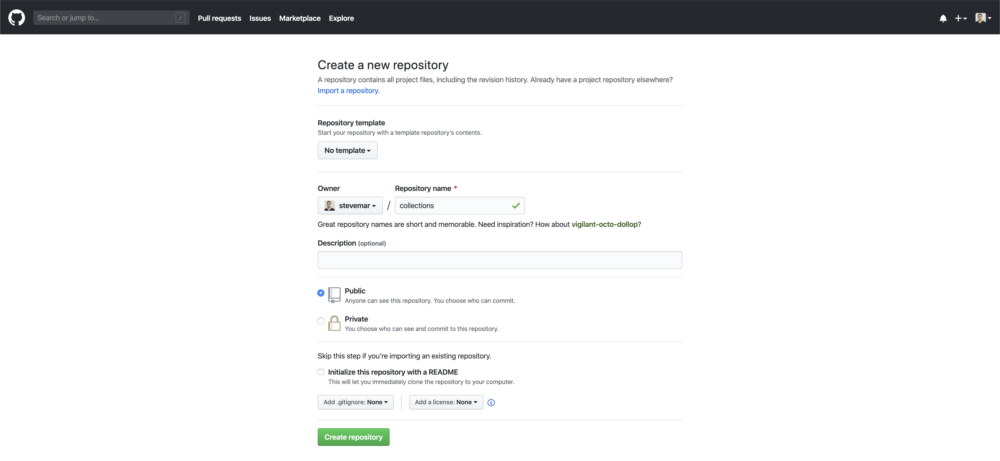
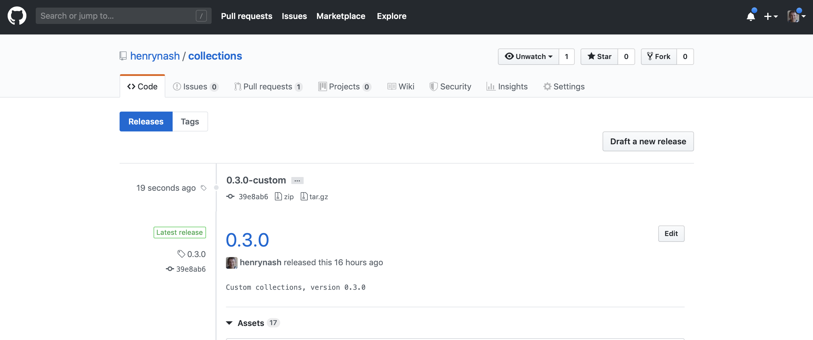
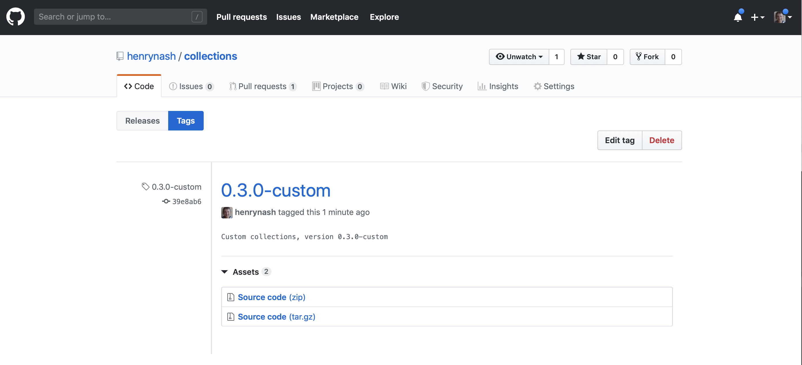
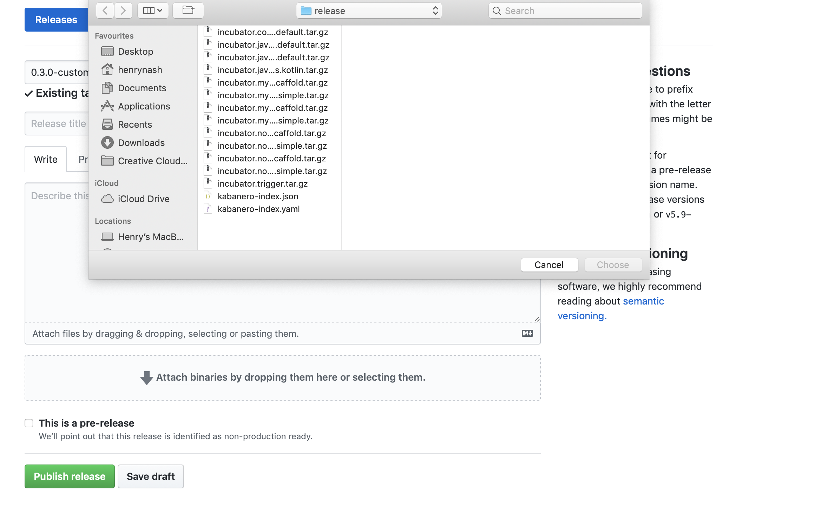
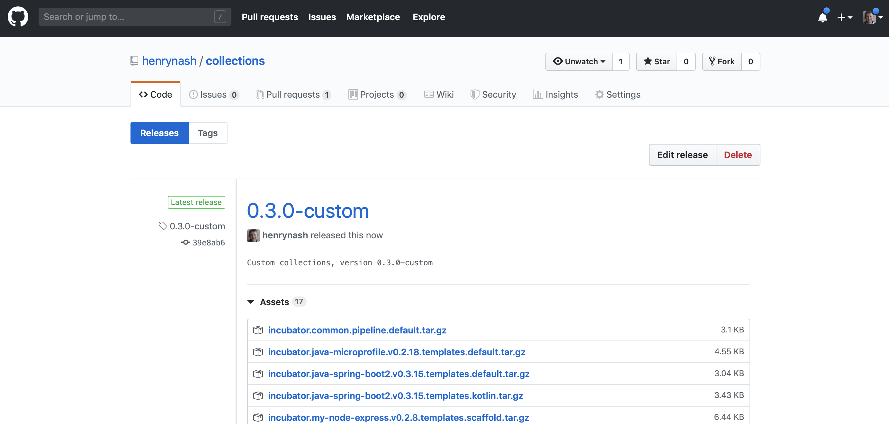

# Exercise 6: Building a custom Appsody Stack Collection in Kabanero

> ***WORK IN PROGRESS***

In this exercise, we will show how to create a custom Kabanero collection, that include the custom Appsody Stack from the previous exercise.

When you have completed this exercise, you will understand how to

* clone and host your own Kabanero Collection
* modify the Collection to include a custom Appsody Stack

## Prerequisites

You should have already carried out the prerequisites defined in [Exercise 5](workshop/exercise-5/README.md). In addition, you need to ensure you have the following installed on your local machine:

* yq
* python3
* pyYAML

On macOS, you can install the above with:

```bash
brew install yq
brew install python
pyYAML
```

## 1. About custom Kabanero Repositories

By default Kabanero Enterprise is configured to automatically use the latest release at [https://github.com/kabanero-io/collections](https://github.com/kabanero-io/collections).

The default collections can be modified to meet an organization's unique needs.

* Collections are categorized as either `stable`, `incubator` or `experimental` depending on the content of the collection.

  * `stable`: collections that meet a set of technical requirements.
  * `incubator`: collections that are actively being worked on to satisfy the stable criteria.
  * `experimental`: collections that are used for trying out specific capabilities or proof of concept work.

* Kabanero Collections include an Appsody stack, and a Tekton pipeline.

## Steps

1. Create a new repo to host your custom collection
1. Create a new image namespace to host images on OpenShift
1. Set up a local build environment
1. Add custom stack to local collection
1. Build collections
1. Push images
1. Update code repo and release a new collection

## 1. Create a new repo to host your custom collection

Go to <https://github.com/new> and create a new repository, `collections`. Do not initiatize the repos with a license file or README.



Clone the default collections repository and create a new copy of it in your GitHub organization, replacing `<username>` with your own.

```bash
cd ~/appsody-apps/
git clone https://github.com/kabanero-io/collections
cd collections
git remote add my-org https://github.com/<username>/collections.git
git push -u my-org
```

### Kabanero Repo structure

```ini
ci
├── [ files used for CI/CD of the Kabanero collections ]
experimental (or incubator, or stable)
├── common/
|   ├── pipelines/
|   |   ├── common-pipeline-1/
|   |   |       └── [pipeline files that make up a full tekton pipeline used with all collections in experimental category]
|   |   └── common-pipeline-n/
|   |           └── [pipeline files that make up a full tekton pipeline used with all collections in experimental category]
├── collection-1/
|   ├── [collection files - see collection structure below]
└── collection-n/
    └── [collection files - see collection structure below]
```

## 2. Create a new image namespace to host images on OpenShift

To actually use the stacks we need images, images will be hosted on openshift

> Despite the warning, this worked

```bash
oc new-project kabanero-noauth
oc policy add-role-to-group registry-viewer system:unauthenticated -n kabanero-noauth
Warning: Group 'system:unauthenticated' not found
role "registry-viewer" added: "system:unauthenticated"
```

## 3. Set up a local build environment

There are several environment variables that need to be set up. These are required in order to correctly build the collections.

```bash
export IMAGE_REGISTRY_ORG=kabanero-noauth
export IMAGE_REGISTRY_PUBLISH=true
export IMAGE_REGISTRY_USERNAME=$(oc whoami)
export IMAGE_REGISTRY_PASSWORD=$(oc whoami -t)
```

In addition to the above the IMAGE_REGISTRY environment variable should still be set from [Exercise 3](workshop/exercise-3/README.md), which you can check with:

```bash
env | grep IMAGE_REGISTRY
```

```bash
$ env | grep
IMAGE_REGISTRY=docker-registry-default.henrycluster6-5290c8c8e5797924dc1ad5d1b85b37c0-0001.eu-gb.containers.appdomain.cloud
```

If IMAGE_REGISTRY is not set, then you need to set it up again described in [Exercise 3 - Access the internal docker registry](workshop/exercise-3/README.md#2-access-the-internal-docker-registry)

## 4. Add custom stack to local collection

Now we take our custom stack from exercise 5 (recall that is was named `my-nodejs-express` and includes the `helmet` library) and copy it over to the incubator folder of our collection repo. From the `collections` repo, perform the following steps:

List the collections before the copy:

```bash
ls incubator
common java-spring-boot2 nodejs-express triggers
java-microprofile nodejs nodejs-loopback
```

Now copy in our new customer stack:

```bash
cp -R ~/appsody-apps/my-nodejs-express incubator
```

Check that we now have this in the list of collections:

```bash
ls incubator
common java-spring-boot2 nodejs nodejs-loopback
java-microprofile my-nodejs-express nodejs-express triggers
```

> FIXME(stevemar): Currently there is no support for creating a stack based off a kabanero stack, only an appsody stack. As a result, the folder `my-nodejs-express` is missing a few things.

Create a new file called `collection.yaml` in `collections/incubator/my-nodejs-express`, add the following:

```yaml
default-image: my-nodejs-express
default-pipeline: default
images:
- id: my-nodejs-express
  image: $IMAGE_REGISTRY_ORG/my-nodejs-express:0.2
```

And also create a directory called `pipelines` in `collections/incubator/my-nodejs-express`, and add a single empty file called `.gitkeep`.

## 4. Build collections

This step builds the `kabanero-index.yaml` file.

From the collections directory, run the build script. For example:

```bash
cd ~/appsody-apps/collections
./ci/build.sh
```

> **NOTE**: This process can take several minutes to complete.

Note that this will build all the collections in the incubator directory, including the new `my-nodejs-express` stack.

Following the build, you can find the generated collection assets in the `collections/ci/assets/` directory and all the docker images in your local docker registry.

You should see output like the following, take note of the `my-nodejs-express` stack being built, and ensure there are no errors in the output:

```bash
...
Listing all stacks
Building stacks: incubator/java-microprofile incubator/java-spring-boot2 incubator/my-nodejs-express incubator/nodejs-express incubator/nodejs-loopback incubator/nodejs
...
- BUILDING stack: incubator/my-nodejs-express
File containing output from image build: /Users/stevemar/appsody-apps/collections/ci/build/image.my-nodejs-express.0.2.8.log
created kabanero/my-nodejs-express:0.2.8
--- Created template archive: incubator.my-nodejs-express.v0.2.8.templates.scaffold.tar.gz
--- Created template archive: incubator.my-nodejs-express.v0.2.8.templates.simple.tar.gz
...
=== Testing my-nodejs-express : scaffold

~/appsody-apps/collections/ci/build/test/kabanero-index-local/my-nodejs-express/scaffold ~/appsody-apps/collections

> appsody init kabanero-index-local/my-nodejs-express scaffold

> appsody run -P --name my-nodejs-express-scaffold
...
> appsody stop --name my-nodejs-express-scaffold

Stopping development environment
Running command: docker stop my-nodejs-express-scaffold
...
> appsody build

error=0
~/appsody-apps/collections
```

## 5. Push images

This command actually pushes the images to the image registry

```bash
./ci/release.sh
```

You should see output like the following, take note of the `my-nodejs-express` stack being pushed to the registry, and ensure there are no errors in the output:

```bash
$ ./ci/release.sh
 == Running pre_env.d scripts
 == Done pre_env.d scripts
 == Running post_env.d scripts
 == Done post_env.d scripts
...
Releasing: /Users/stevemar/appsody-apps/collections/ci/assets/incubator.my-nodejs-express.v0.2.8.templates.scaffold.tar.gz
Releasing: /Users/stevemar/appsody-apps/collections/ci/assets/incubator.my-nodejs-express.v0.2.8.templates.simple.tar.gz
...
Pushing docker-registry-default.cp4apps-workshop-prop-5290c8c8e5797924dc1ad5d1b85b37c0-0001.us-east.containers.appdomain.cloud/kabanero-noauth/my-nodejs-express
The push refers to repository [docker-registry-default.cp4apps-workshop-prop-5290c8c8e5797924dc1ad5d1b85b37c0-0001.us-east.containers.appdomain.cloud/kabanero-noauth/my-nodejs-express]
535ab22146d1: Layer already exists
0: digest: sha256:535ab22146d1 size: 3883
535ab22146d1: Layer already exists
0.2: digest: sha256:535ab22146d1 size: 3883
535ab22146d1: Layer already exists
0.2.8: digest: sha256:535ab22146d1 size: 3883
535ab22146d1: Layer already exists
latest: digest: sha256:535ab22146d1 size: 3883
Tagging docker-registry-default.cp4apps-workshop-prop-5290c8c8e5797924dc1ad5d1b85b37c0-0001.us-east.containers.appdomain.cloud/kabanero-noauth/my-nodejs-express:0.2.8
> docker tag kabanero-noauth/my-nodejs-express:0.2.8 docker-registry-default.cp4apps-workshop-prop-5290c8c8e5797924dc1ad5d1b85b37c0-0001.us-east.containers.appdomain.cloud/kabanero-noauth/my-nodejs-express:0.2.8
...
```

## FIXME(stevemar): update generated kabanero-index.yaml manually

Open up `collections/ci/release/kabanero-index.yaml` and find your custom stack. Change the `image` URL to specify your docker registry. It should look like:

```yaml
- default-image: my-nodejs-express
  default-pipeline: default
  default-template: simple
  description: Express web framework for Node.js with Helmet
  id: my-nodejs-express
  images:
  - id: my-nodejs-express
    image: docker-registry-default.cp4apps-workshop-prop-5290c8c8e5797924dc1ad5d1b85b37c0-0001.us-east.containers.appdomain.cloud/kabanero-noauth/my-nodejs-express:0.2
  language: nodejs
  license: Apache-2.0
  maintainers:
  - email: stevemar@ca.ibm.com
    github-id: stevemar
    name: Steve Martinelli
  name: Node.js Express with Helmet
  pipelines:
  - id: default
    sha256: 9f202247428d421fd9045a2090204c138c156ca57db1d5deacfb658e599aa2bf
    url: https://github.com/stevemar/collections/releases/download/0.3.0/incubator.common.pipeline.default.tar.gz
  templates:
  - id: scaffold
    url: https://github.com/stevemar/collections/releases/download/0.3.0/incubator.my-nodejs-express.v0.2.8.templates.scaffold.tar.gz
  - id: simple
    url: https://github.com/stevemar/collections/releases/download/0.3.0/incubator.my-nodejs-express.v0.2.8.templates.simple.tar.gz
  version: 0.2.8
```

## 6. Update code repo and release a new collection

Once you have made all the changes to the collection and you are ready to push the changes back to your git repository then

```bash
# Add your custom stack changes
git add -A

# Create a commit message
git commit -m "Updates to the collections"

# Push the changes to your repository.  For example:
git push -u my-org
```

To create a full release of the collections, create a git tag:

```bash
git tag 0.3.0-custom -m "Custom collections, version 0.3.0-custom"
git push --tags
```

Navigating back to your GitHub repo, you should see a new release available:



Clicking on the release name (0.3.0-custom) will allow you to edit the release.



Click on *Edit tag*. and then upload all the files in `collections/ci/release/` which were generated from the previous steps, by clicking on the *Attach binaries...* box.



Once you have uploaded the files you can publish your new collection by clicking *Publish release*, at the bottom of the page



You will note that the collection includes the `kabanero-index.yaml` file we edited earlier. The url to this index file is is what you will provide appsody as a link to your new custom repository (that is contained within the new collection. You normally obtain and copy the url (depending on your browser) by CNTL-clicking over the `kabanero-index.yaml` item in the list of files shown in the release. It should be of the form:

`https://github.com/<username>/collections/releases/download/0.3.0-custom/kabanero-index.yaml`

You will need this url for the next exercise, where we will create an appsody application based on your new collection.

**Congratulations!!** We've just created our own custom collection that included our own custom stack. Now we need to update our Kabanero instance to use this new collection. On to the next exercise.
