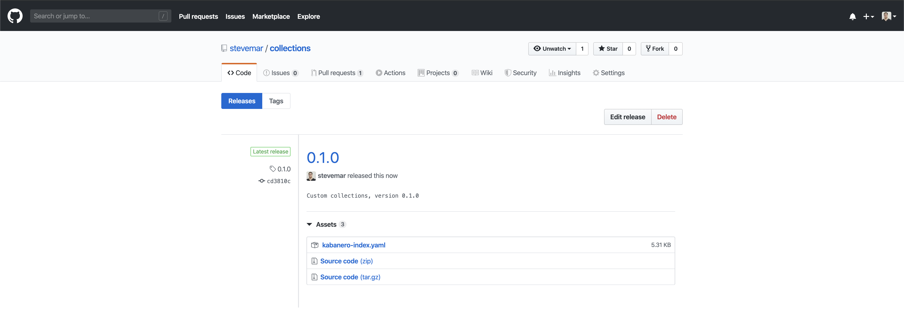

# Exercise 6: Building a custom Appsody Stack Collection in Kabanero

In this exercise, we will show how to create a custom Kabanero collection, that include the custome Appsody Stack from the previous exercise.

When you have completed this exercise, you will understand how to

* clone and host your own Kabanero Collection
* modify the Collection to include a custom Appsody Stack

## Prerequisites

You should have already carried out the prerequisites defined in [Exercise 5](workshop/exercise-5/README.md).

## 1. About custom Kabanero Repositories

By default Kabanero Enterprise is configured to automatically use the latest release at [https://github.com/kabanero-io/collections](https://github.com/kabanero-io/collections).

The default collections can be modified to meet an organization's unique needs.

* Collections are categorized as either `stable`, `incubator` or `experimental` depending on the content of the collection.

  * `stable`: collections that meet a set of technical requirements.
  * `incubator`: collections that are actively being worked on to satisfy the stable criteria.
  * `experimental`: collections that are used for trying out specific capabilities or proof of concept work.

* Kabanero Collections include an Appsody stack, and a Tekton pipeline.

## Steps

1. Create a new repo to host your custom collection
1. Set up a local build environment
1. Add custom stack to local collection
1. Build collections
1. Push changes and release a new collection

## 1. Create a new repo to host your custom collection

Go to <https://github.com/new> and create a new repository, `collections`. Do not initiatize the repos with a license file or README.


Clone the default collections repository and create a new copy of it in your GitHub organization, replacing `<username>` with your own.

```bash
cd ~/appsody-apps/
git clone https://github.com/kabanero-io/collections
cd collections
git remote add my-org https://github.com/<username>/collections.git
git push -u my-org
```

### Kabanero Repo structure

```ini
ci
├── [ files used for CI/CD of the Kabanero collections ]
experimental (or incubator, or stable)
├── common/
|   ├── pipelines/
|   |   ├── common-pipeline-1/
|   |   |       └── [pipeline files that make up a full tekton pipeline used with all collections in experimental category]
|   |   └── common-pipeline-n/
|   |           └── [pipeline files that make up a full tekton pipeline used with all collections in experimental category]
├── collection-1/
|   ├── [collection files - see collection structure below]
└── collection-n/
    └── [collection files - see collection structure below]
```

## 2. Set up a local build environment

There are several tools that are used to build:

* `yq`: Command-line YAML processor (macOS: `brew install yq`)
* `docker`: A tool to help you build and run apps within containers

There are several environment variables that need to be set up. These are required in order to correctly build the collections.

> TODO(stevemar): I didn't need to set up any env vars... i'm not sure if i need `yq` or not.

## 3. Add custom stack to local collection

Now we take our custom stack from exercise 5 (recall that is was named `my-nodejs-express` and includes the `helmet` library) and copy it over to the incubator folder of our collection repo. From the `collections` repo, perform the following steps:

Listing before the copy:

```bash
ls incubator
common java-spring-boot2 nodejs-express triggers
java-microprofile nodejs nodejs-loopback

```bash
cp -R ~/appsody-apps/my-nodejs-express incubator
```

Listing after the move:

```bash
ls incubator
common java-spring-boot2 nodejs nodejs-loopback
java-microprofile my-nodejs-express nodejs-express triggers
```

## 4. Build collections

From the collections directory, run the build script. For example:

```bash
./ci/build.sh
```

Note that this will build all the collections in the incubator directory, including the new `my-nodejs-express` stack.

Following the build, you can find the generated collection assets in the `collections/ci/assets/` directory and all the docker images in your local docker registry.

You should see output like the following, take not of the `my-nodejs-express` stack being built, and ensure there are no errors in the output:

```bash
...
Listing all stacks
Building stacks: incubator/java-microprofile incubator/java-spring-boot2 incubator/my-nodejs-express incubator/nodejs-express incubator/nodejs-loopback incubator/nodejs
...
- BUILDING stack: incubator/my-nodejs-express
File containing output from image build: /Users/stevemar/appsody-apps/collections/ci/build/image.my-nodejs-express.0.2.8.log
created kabanero/my-nodejs-express:0.2.8
--- Created template archive: incubator.my-nodejs-express.v0.2.8.templates.scaffold.tar.gz
--- Created template archive: incubator.my-nodejs-express.v0.2.8.templates.simple.tar.gz
...
=== Testing my-nodejs-express : scaffold

~/appsody-apps/collections/ci/build/test/kabanero-index-local/my-nodejs-express/scaffold ~/appsody-apps/collections

> appsody init kabanero-index-local/my-nodejs-express scaffold

> appsody run -P --name my-nodejs-express-scaffold
...
> appsody stop --name my-nodejs-express-scaffold

Stopping development environment
Running command: docker stop my-nodejs-express-scaffold
...
> appsody build

error=0
~/appsody-apps/collections
```

## 5. Push changes and release a new collection

Once you have made all the changes to the collection and you are ready to push the changes back to your git repository then

```bash
# Add your custom stack changes
git add -A

# Create a commit message
git commit -m "Updates to the collections"

# Push the changes to your repository.  For example:
git push -u my-org
```

To create a full release of the collections, create a git tag:

```bash
git tag 0.1.0 -m "Custom collections, version 0.1.0"
git push --tags
```

Navigating back to your GitHub repo, you should see a new release available:


Click on *Edit tag*.

Upload the file `collections/ci/assets/kabanero-index.yaml`, which was generated as the images were built.


You should now see that your release includes `kabanero-index.yaml`.



The YAML file can be accessed with the URL:

`https://github.com/<username>/collections/releases/download/0.1.0/kabanero-index.yaml`

**Congratulations!!** We've just created our own custom collection that included our own custom stack. Now we need to update our Kabanero instance to use this new collection. On to the next exercise.
