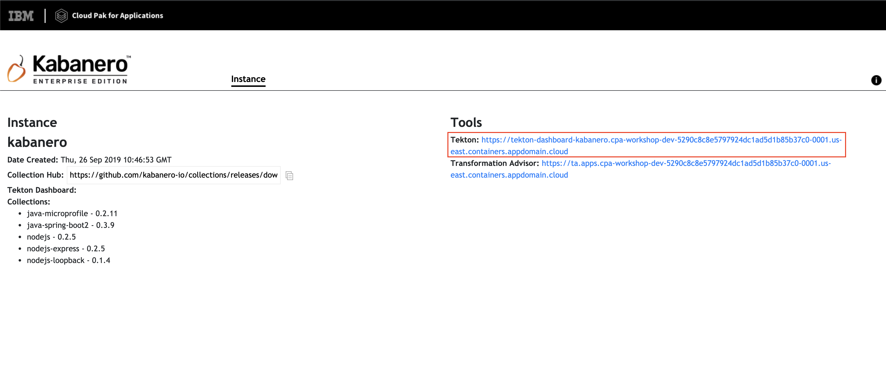
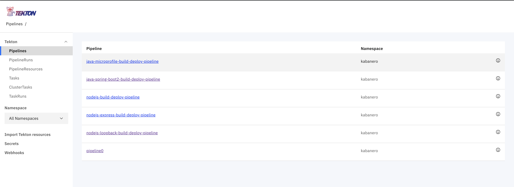
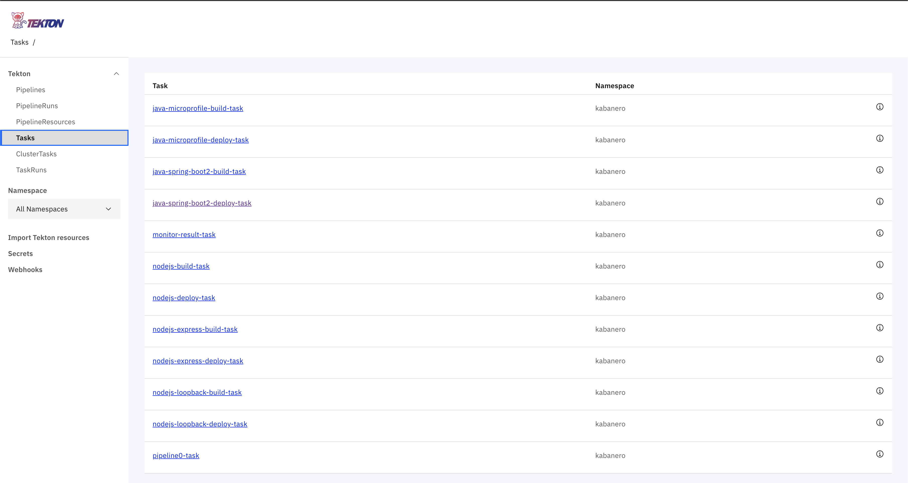
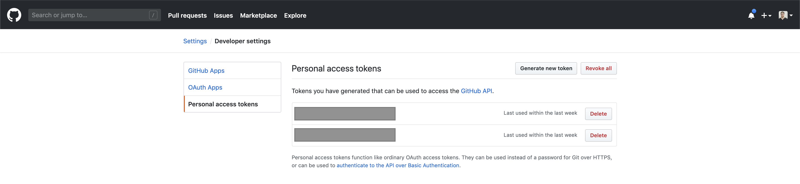
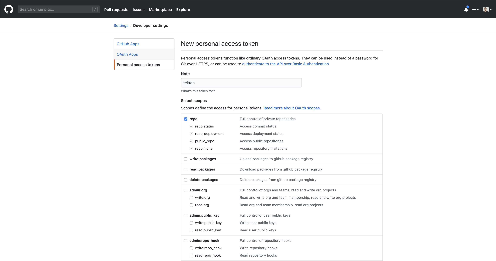
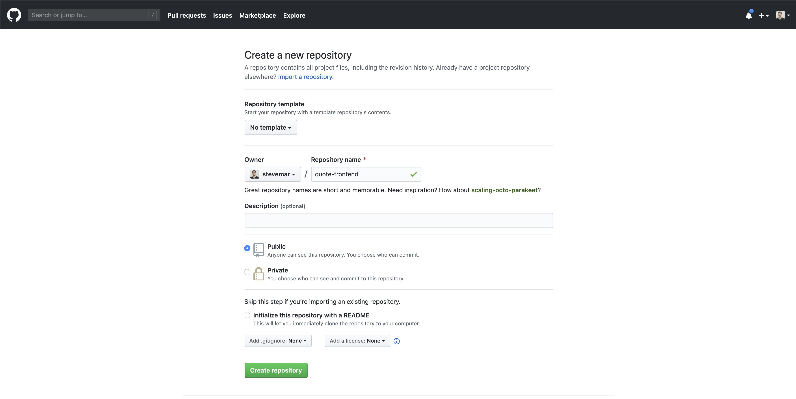
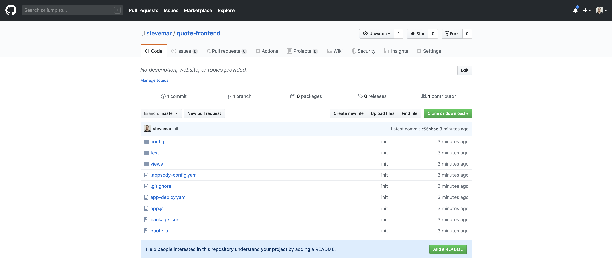
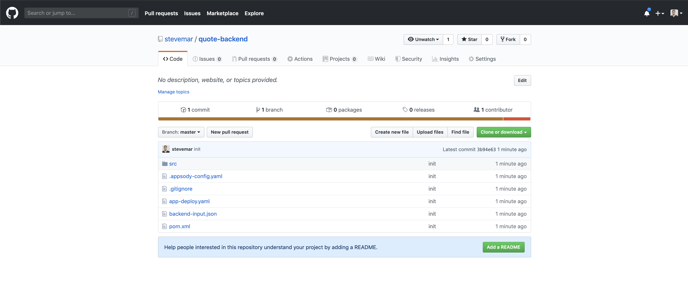

# Exercise 6: Building a simple Tekton pipeline

In this exercise we're going to take our insurance quote application from exercise 3 and instead of deploying it as a stand alone app, we will push the code up to a github repo and use Tekton pipelines to constantly deploy the app to our openshift cluster and speed up your deployment process.

Mention the insurance quote arch again?

* The front-end is constructed with Node.js
* The back-end is done in Java

This section is broken up into the following steps:

1. Prereq: Clean up the deployed app
1. Review pre-installed pipelines and tasks on Cloud Pak for Apps
1. ?
1. ?

## Prereq: Clean up the deployed app

Run:

```bash
$ oc get deployments
NAME               DESIRED   CURRENT   UP-TO-DATE   AVAILABLE   AGE
appsody-operator   1         1         1            1           7d
quote-backend      1         1         1            1           6d
quote-frontend     1         1         1            1           6d

$ oc delete deployment quote-backend
deployment.extensions "quote-backend" deleted

$ oc delete deployment quote-frontend
deployment.extensions "quote-frontend" deleted
```

> TODO: see if `appsody deploy delete` also works

Note, we still have the `insurance-quote` namespace, the `dacadoo-secret` config map, and the `appsody-operator` deployment.

## Go to the Tekton dashboard

You can also access them on the tekton dashboard from Cloud Pak for Apps.



We should already be logged into the Tekton Dashboard, but you can also view the URL by using `oc get routes`. We want to use the address that looks like `tekton-dashboard-kabanero.xyz.domain.containers.appdomain.cloud`.

```bash
$ oc get routes --namespace kabanero
NAME               HOST/PORT                                                                                                             PATH      SERVICES           PORT      TERMINATION          WILDCARD
icpa-landing       ibm-cp-applications.cpa-workshop-dev-5290c8c8e5797924dc1ad5d1b85b37c0-0001.us-east.containers.appdomain.cloud                   icpa-landing       <all>     reencrypt/Redirect   None
kabanero-cli       kabanero-cli-kabanero.cpa-workshop-dev-5290c8c8e5797924dc1ad5d1b85b37c0-0001.us-east.containers.appdomain.cloud                 kabanero-cli       <all>     passthrough          None
kabanero-landing   kabanero-landing-kabanero.cpa-workshop-dev-5290c8c8e5797924dc1ad5d1b85b37c0-0001.us-east.containers.appdomain.cloud             kabanero-landing   <all>     passthrough          None
tekton-dashboard   tekton-dashboard-kabanero.cpa-workshop-dev-5290c8c8e5797924dc1ad5d1b85b37c0-0001.us-east.containers.appdomain.cloud             tekton-dashboard   <all>     reencrypt/Redirect   None
```

## 1. Review pre-installed pipelines and tasks on Cloud Pak for Apps

With kabanero, every collection comes with a default `build` task, `deploy` task and `build deploy` pipeline.

Run this command to see the available pipelines.

```bash
oc get pipeline -n kabanero
```

You will see something similar to this.

```bash
$ oc get pipeline -n kabanero
NAME                                           AGE
java-microprofile-build-deploy-pipeline        15d
java-spring-boot2-build-deploy-pipeline        15d
nodejs-build-deploy-pipeline                   15d
nodejs-express-build-deploy-pipeline           15d
nodejs-loopback-build-deploy-pipeline          15d
pipeline0                                      15d
```

And tasks

```bash
stevemar@quote-frontend $ oc get tasks -n kabanero
NAME                            AGE
java-microprofile-build-task    27d
java-microprofile-deploy-task   27d
java-spring-boot2-build-task    27d
java-spring-boot2-deploy-task   27d
monitor-result-task             27d
nodejs-build-task               27d
nodejs-deploy-task              27d
nodejs-express-build-task       27d
nodejs-express-deploy-task      27d
nodejs-loopback-build-task      27d
nodejs-loopback-deploy-task     27d
pipeline0-task                  27d
```





## Get a GitHub Access Token

When using Tekton, building a pipeline will require code to be pulled from either a public or private repository. When configuring Tekton, for security reasons, we will create an *Access Token* instead of using a password.

To create an *Access Token*, from <github.com> click on your profile icon in the top left. Then go to `Settings` -> `Developer Settings` -> `Personal Access Tokens`. Or go directly to <https://github.com/settings/tokens>



Here we want to generate a token, so `Click` on the `Generate a Token`. The token permissions need to be the `repo` which gives read and write access to the repository.



Once the token is created, make sure to copy it down. We will need it later.

## Upload insurance quote frontend, and backend to GitHub

Open Github.com and `login` with your username and password.

Go to <https://github.com/new> and create two new repositories, `quote-frontend`, and `quote-backend`. Do not initiatize the repos with a License or README.



From your `quote-backend` directory, run the commands below, replacing `<username>` with your own.

```bash
git init
git add -A
git commit -m "first commit"
git remote add origin git@github.com:<username>/quote-backend.git
git push -u origin master
```




## Configure Tekton with Github Access Token

Once on the dashboard, open up the `Secrets` tab that is found on the bottom left side of the screen.


From there select the `Add Secret` button on the right side of the screen.

Next, we want to fill in the form with the following information:

```bash
Name: tekton-github
Namespace: kabanero
Access To: Git Server
Username: <yourusername>
Password: <Generated Token>
Service Account: kabanero-operator
Server URL: tekton.dev/git-0:https://github.com
```


Then click on `Submit` and your token is registered.

## Configure Tekton to point to repos

Configure webhooks

Make a change to a file

Test it out
