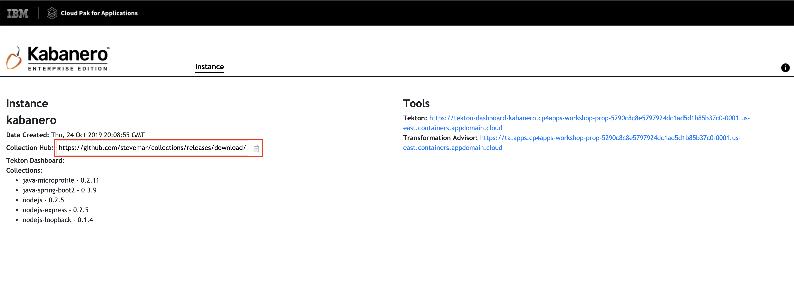

# Exercise 7: Configuring Kabanero to use an Alternate Collection Repository

> ***WORK IN PROGRESS***

In this exercise, we will show how to update your Kabanero instance to use a custom Kabanero Collection Hub.

When you have completed this exercise, you will understand how to

* update some YAML

## Prerequisites

You should have already carried out the prerequisites defined in [Exercise 6](workshop/exercise-6/README.md).

## Steps

1. Get release URL
2. Edit Kabanero Custom Resource
3. Test it out

## 1. Get release URL

Obtain the URL to the collection repository. If a Git release was created for the collections, the URL format will be: `https://<github.com>/<organization>/collections/releases/download/<release>/kabanero-index.yaml`

In our workshop, it'll likely be:

`https://github.com/<username>/collections/releases/download/0.3.0-custom/kabanero-index.yaml`

* Replace `<username>` with your Github username

## 2. Edit Kabanero Custom Resource

Use `oc get kabaneros -n kabanero` to obtain a list of all Kabanero CR instances in namespace `kabanero`. The default name for the CR instance is `kabanero`.

```bash
oc get kabaneros -n kabanero
```

You should see output similar to the following:

```bash
$ oc get kabaneros -n kabanero
NAME       AGE       VERSION   READY
kabanero   17d       0.1.0     True
```

Edit the specific CR instance using `oc edit kabaneros <name> -n kabanero`, replacing `<name>` with the instance name.

```bash
oc edit kabaneros kabanero -n kabanero
```

Modify your Kabanero custom resource (CR) instance to target the new collections that were pushed to the remote Github repository. The `Spec.Collections.Repositories.url` attribute should be set to the URL of the collection repository.

```yaml
apiVersion: kabanero.io/v1alpha1
kind: Kabanero
metadata:
  name: kabanero
  namespace: kabanero
spec:
  collections:
    repositories:
    - name: custom
      url: https://github.com/<username>/collections/releases/download/0.3.0-custom/kabanero-index.yaml
      activateDefaultCollections: true
```

When you are done editing, save your changes and exit the editor. The updated Kabanero CR instance will be applied to your cluster.

## 3. Test it out

First, your collection should appear in the Cloud Pak for Applications dashboard.



Let's add the repo

```bash
appsody repo add stevemar https://github.com/stevemar/collections/releases/download/0.3.0/kabanero-index.yaml
```

Create a new directory to work in:

```bash
cd ~/appsody-apps
mkdir test-custom
cd test-custom
```

Initialize the appsody stack

```bash
$ appsody init stevemar/my-nodejs-express
Running appsody init...
Downloading my-nodejs-express template project from https://github.com/stevemar/collections/releases/download/0.3.0-custom/incubator.my-nodejs-express.v0.2.8.templates.simple.tar.gz
Download complete. Extracting files from /Users/stevemar/appsody-apps/testo/my-nodejs-express.tar.gz
Setting up the development environment
Your Appsody project name has been set to testo
Pulling docker image docker-registry-default.cp4apps-workshop-prop-5290c8c8e5797924dc1ad5d1b85b37c0-0001.us-east.containers.appdomain.cloud/kabanero-noauth/my-nodejs-express:0.2
Running command: docker pull docker-registry-default.cp4apps-workshop-prop-5290c8c8e5797924dc1ad5d1b85b37c0-0001.us-east.containers.appdomain.cloud/kabanero-noauth/my-nodejs-express:0.2
0.2: Pulling from kabanero-noauth/my-nodejs-express
Digest: sha256:3a2a5042e70e3a70a2b8dd024ad68c9613eeda90cce13749c1dc80565d61d303
Status: Image is up to date for docker-registry-default.cp4apps-workshop-prop-5290c8c8e5797924dc1ad5d1b85b37c0-0001.us-east.containers.appdomain.cloud/kabanero-noauth/my-nodejs-express:0.2
docker-registry-default.cp4apps-workshop-prop-5290c8c8e5797924dc1ad5d1b85b37c0-0001.us-east.containers.appdomain.cloud/kabanero-noauth/my-nodejs-express:0.2
[Warning] The stack image does not contain APPSODY_PROJECT_DIR. Using /project
Running command: docker run --rm --entrypoint /bin/bash docker-registry-default.cp4apps-workshop-prop-5290c8c8e5797924dc1ad5d1b85b37c0-0001.us-east.containers.appdomain.cloud/kabanero-noauth/my-nodejs-express:0.2 -c find /project -type f -name .appsody-init.sh
Successfully initialized Appsody project
```

Run it:

```bash
$ appsody run
Running development environment...
Pulling docker image docker-registry-default.cp4apps-workshop-prop-5290c8c8e5797924dc1ad5d1b85b37c0-0001.us-east.containers.appdomain.cloud/kabanero-noauth/my-nodejs-express:0.2
Running command: docker pull docker-registry-default.cp4apps-workshop-prop-5290c8c8e5797924dc1ad5d1b85b37c0-0001.us-east.containers.appdomain.cloud/kabanero-noauth/my-nodejs-express:0.2
0.2: Pulling from kabanero-noauth/my-nodejs-express
Digest: sha256:3a2a5042e70e3a70a2b8dd024ad68c9613eeda90cce13749c1dc80565d61d303
Status: Image is up to date for docker-registry-default.cp4apps-workshop-prop-5290c8c8e5797924dc1ad5d1b85b37c0-0001.us-east.containers.appdomain.cloud/kabanero-noauth/my-nodejs-express:0.2
docker-registry-default.cp4apps-workshop-prop-5290c8c8e5797924dc1ad5d1b85b37c0-0001.us-east.containers.appdomain.cloud/kabanero-noauth/my-nodejs-express:0.2
Running docker command: docker run --rm -p 3000:3000 -p 9229:9229 --name testo-dev -v /Users/stevemar/appsody-apps/testo/:/project/user-app -v testo-deps:/project/user-app/node_modules -v /Users/stevemar/.appsody/appsody-controller:/appsody/appsody-controller -t --entrypoint /appsody/appsody-controller docker-registry-default.cp4apps-workshop-prop-5290c8c8e5797924dc1ad5d1b85b37c0-0001.us-east.containers.appdomain.cloud/kabanero-noauth/my-nodejs-express:0.2 --mode=run
[Container] Running APPSODY_PREP command: npm install --prefix user-app && npm audit fix --prefix user-app
added 170 packages from 578 contributors and audited 295 packages in 2.989s
[Container] found 0 vulnerabilities
...
Application Metrics 5.0.3.201908230949 (Agent Core 4.0.3)
[Container] [Tue Nov 12 03:13:32 2019] com.ibm.diagnostics.healthcenter.mqtt INFO: Connecting to broker localhost:1883
[Container] App started on PORT 3000
```

Test it out with `curl` and you'll see the helmet headers.

**Congratulations!!** We've got our Kabanero instance updated to use our custom collection.
