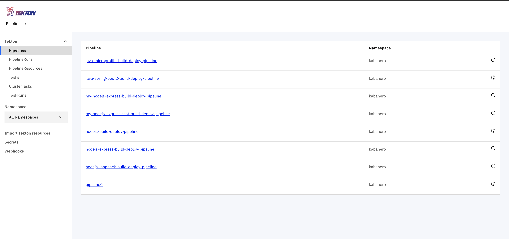

# Exercise 9: Deploy an application with a custom Stack, custom Collection, and custom Tekton Pipeline

> WORK IN PROGRESS

In this exercise, we will show how to ...

When you have completed this exercise, you will understand how to

* ...
* ...

> TODO(stevemar): update this image


## Prerequisites

You should have already carried out the prerequisites defined in [Exercise 8](../exercise-8/README.md).

* Delete the webhook from Exercise 8

* Delete the task and pipeline from Exercise 8, too.

Run `tkn task delete` and `tkn pipeline delete`

## Steps

### 1. Add the tasks to the collection

In your local `collections/incubator/my-nodejs-express/pipelines` folder add a new folder called `custom-pipeline` and add two files `test-task.yaml` and `test-build-deploy-pipeline.yaml`. The file structure is seen below

```ini
incubator
└── my-nodejs-express/
    └── pipelines/
        └── my-custom-pipeline/
                └── test-task.yaml
                └── test-build-deploy-pipeline.yaml
```

The `test-task.yaml` is the same as in Exercise 8

```yaml
apiVersion: tekton.dev/v1alpha1
kind: Task
metadata:
  name: test-task
spec:
  inputs:
    resources:
      - name: git-source
        type: git
  steps:
    - name: test-echo
      image: kabanero/nodejs-express:0.2
      workingDir: ${inputs.resources.git-source.path}
      command:
        - /bin/bash
      args:
        - -c
        - |
          set -e
          echo "APPSODY_INSTALL:"
          echo $APPSODY_INSTALL
          echo "APPSODY_TEST:"
          echo $APPSODY_TEST
          echo "APPSODY_WATCH_DIR:"
          echo $APPSODY_WATCH_DIR
          echo "------"
          echo "My working directory is:"
          pwd
          ls
          echo "------"
          echo "I built my first Kabanero based Tekton task"
```

And the `test-build-deploy-pipeline.yaml` is a modification of the defauly pipeline:

```yaml
#Kabanero! on activate substitute CollectionId for text 'CollectionId'
apiVersion: tekton.dev/v1alpha1
kind: Pipeline
metadata:
  name: CollectionId-test-build-deploy-pipeline
spec:
  resources:
    - name: git-source
      type: git
    - name: docker-image
      type: image
  tasks:
    - name: test-task
      taskRef:
        name: test-task
      resources:
        inputs:
        - name: git-source
          resource: git-source
        outputs:
        - name: docker-image
          resource: docker-image
    - name: build-task
      taskRef:
        name: CollectionId-build-task
      runAfter: [test-task]
      resources:
        inputs:
        - name: git-source
          resource: git-source
        outputs:
        - name: docker-image
          resource: docker-image
    - name: deploy-task
      taskRef:
        name: CollectionId-deploy-task
      runAfter: [build-task]
      resources:
        inputs:
        - name: git-source
          resource: git-source
        - name: docker-image
          resource: docker-image
```

Also update the default pipeline for this collection?

In `incubator/my-nodejs-express` update `collection.yaml` to change the default pipeline

```yaml
default-image: my-nodejs-express
default-pipeline: CollectionId-test-build-deploy-pipeline
images:
- id: my-nodejs-express
  image: $IMAGE_REGISTRY_ORG/my-nodejs-express:0.2
```

### 2. Re-run the scripts

Run `build.sh` and `release.sh` again. From collections home run:

```bash
./ci/build.sh
./ci/release.sh
```

Check the `ci/release/` folder to make sure there is a file called:

```ini
incubator.my-nodejs-express.v0.2.9.pipeline.custom-pipeline.tar
```

And that the generated `ci/release/kabanero-index.yaml` has a section like the following:

```yaml
- default-image: my-nodejs-express
  ...
  pipelines:
  - id: custom-pipeline
    sha256: e3c3050850bf88b97c8fba728592d0cf671bb9d27b582ebaa9f90d939bfa60a5
    url: https://github.com/stevemar/collections/releases/download/0.2.1/incubator.my-nodejs-express.v0.2.9.pipeline.custom-pipeline.tar.gz
```

### 3. Release a point release

Upload the changes and add a new tag

```bash
# Add your custom stack changes
git add -A

# Create a commit message
git commit -m "Add custom task and pipeline"

# Push the changes to your repository.  For example:
git push -u my-org
```

To create a full release of the collections, create a git tag:

```bash
git tag 0.3.1-custom -m "Custom collections, version 0.3.1-custom"
git push --tags
```

> Needs more text here...

Re-add the files with the GitHub UI

### 4. Update Kabanero CRD

Run:

```bash
oc edit kabaneros kabanero -n kabanero
```

Update the URL with the new release

```yaml
apiVersion: kabanero.io/v1alpha1
kind: Kabanero
metadata:
  name: kabanero
  namespace: kabanero
spec:
  collections:
    repositories:
    - name: custom
      url: https://github.com/<username>/collections/releases/download/0.3.1-custom/kabanero-index.yaml
      activateDefaultCollections: true
```

### 5. Test it all out

Go to tekton, you should see the new pipeline and task (it was added when updating the Kabanero CRD)



Re-add the webhook, this time you should see the new pipeline as an option (without having to do `kubectl apply`).

It should, in addition to running the new test task, also run the build and deploy task.

Confirm it works with a curl -v to the route, should see helmet responses.

**Congratulations!!** You've successfully completed Day 2 of the workshop!
