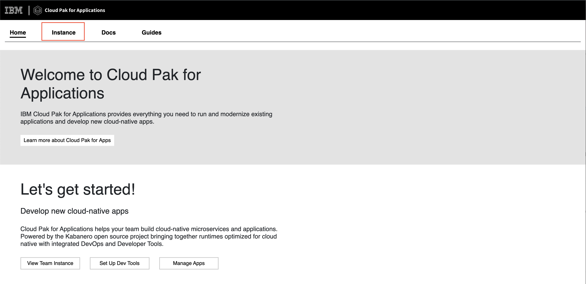
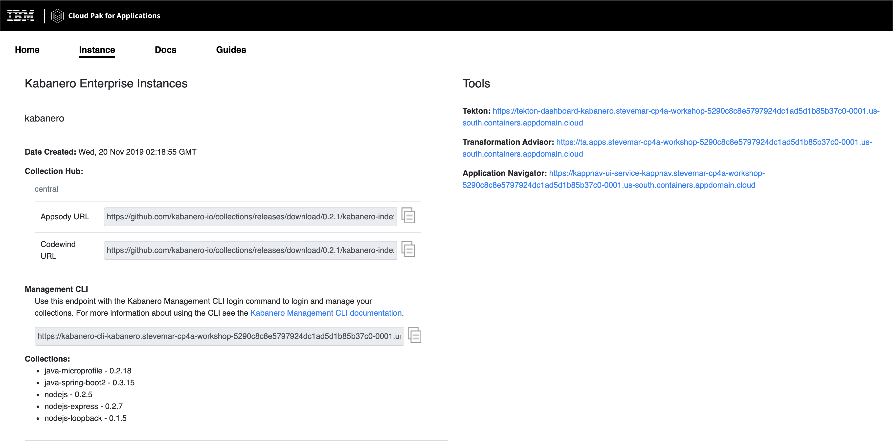

# Pre-work

This section is broken up into the following steps:

1. [IDs](#1-ids)
1. [Install Docker](#2-install-docker)
1. [Install Appsody CLI](#3-install-appsody-cli)
1. [Check access to OpenShift cluster](#4-check-access-to-openshift-cluster)
1. [Ensure Cloud Pak for Applications is installed](#5-ensure-cloud-pak-for-applications-is-installed)

## 1. IDs

The following IDs are needed for this workshop:

* [Github](https://github.com)
* [IBM Cloud](https://cloud.ibm.com)

## 2. Install Docker

A key part of the Appsody development experience is Rapid Local Development Mode, where the code you develop is continuously being run in a local docker container. If you don't already have Docker installed on your machine, you should do so now:

[Install Docker](https://docs.docker.com/get-started/)

## 3. Install Appsody CLI

Appsody includes a CLI which allows you to manage you stack based development (this workshop requries version 0.4.10 or later). This should be installed on your development machine:

[Install the Appsody CLI](https://appsody.dev/docs/getting-started/installation)

You can check that you have the correct version installed by executing the command:

```bash
appsody version
```

You should see output similar to the following:

```bash
$ appsody version
appsody 0.4.10
```

## 4. Check access to OpenShift cluster

You should already have been provided with details of a managed OpenShift cluster that has been provisioned for you. Check you have access to this by using the `oc login` with the credentials the workshop administrator provides to you.

```bash
oc login <url> --token=<token>
```

## 5. Ensure Cloud Pak for Applications is installed

Cloud Pak for Applications should already have been installed in your managed OpenShift cluster. Check you have access to this by ensuring that *Kabanero Enterprise* exists in the *Application Console* of your OpenShift cluster.


When clicked, the *Cloud Pak for Applications* landing page should appear:



Clicking on the *Kabanero Enterprise instance* link will show you information about your Kabanero Enterprise service.


